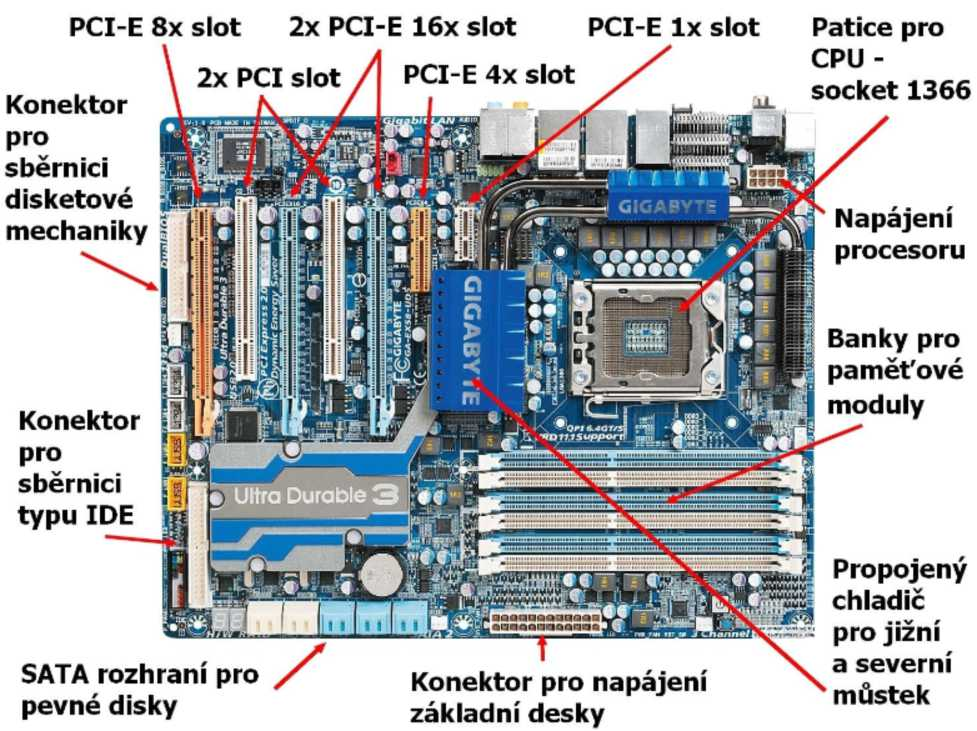
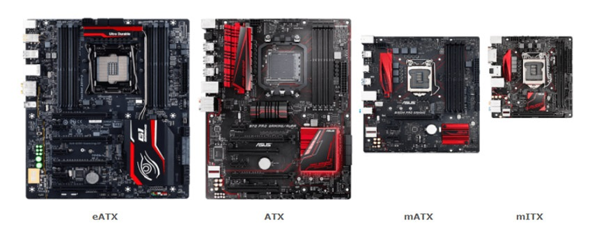

# Základní deska (Motherboard)
### 1. DefiniceZákladní deska  
- je hlavní součástka počítače, která propojuje všechny jeho komponenty a zajišťuje jejich komunikaci.
---
### 2. Hlavní součásti základní desky

* Socket procesoru – konektor pro připojení procesoru.

* Paměťové sloty (RAM) – slouží k instalaci operační paměti.

* Čipset – řídí komunikaci mezi komponentami.

* Sloty pro grafickou kartu (PCIe) – zajišťují rozšíření grafických možností.

* Konektory pro pevné disky a SSD (SATA, M.2) – slouží k připojení úložišt.

* Porty USB, audio a síťové konektory – slouží k propojení s externími zařízením.

---
## Hlavní součásti základní desky

---
### 3. Typy základních desek

* ATX – standardní velikost, nejčastěji používaná v desktopových PC.

* Micro-ATX – menší varianta ATX, s méně sloty pro rozšíření.

* Mini-ITX – kompaktní deska určená pro malé PC sestavy.

---
## Typy základních desek

---
### 4. Faktory ovlivňující výběr základní desky

* Kompatibilita s procesorem – správný socket a čipset.

* Maximální množství RAM – počet slotů a podporovaná kapacita.

* Možnosti rozšíření – PCIe sloty, M.2 konektory apod.

* Konektivita – USB porty, síťové připojení, audio výstupy.

---
### 5. Důležité pojmy

* BIOS/UEFI – základní firmware základní desky.

* VRM (Voltage Regulator Module) – reguluje napětí procesoru.

* Overclocking – možnost zvýšení výkonu procesoru a RAM.

---
### 6. Závěr 
* základní deska je klíčovým prvkem počítače, který určuje jeho možnosti a výkon. Při jejím výběru je nutné zvážit kompatibilitu s ostatními komponentami a požadované funkce.

---