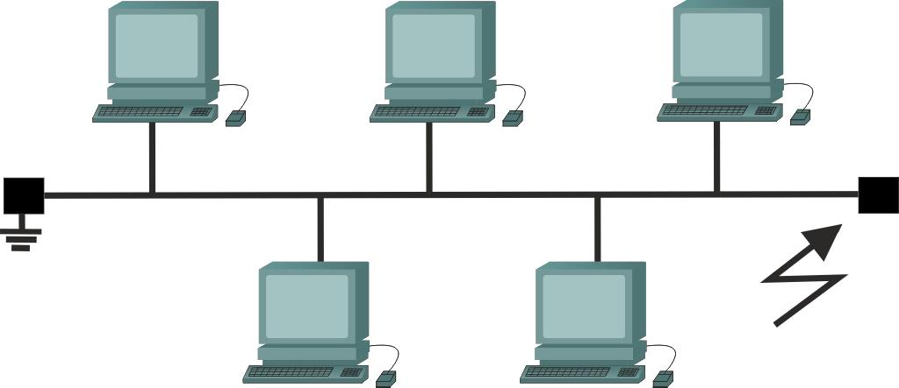

# Odpovědi na otázky 1. ročníku

## 1. Vysvětlete rozdíl mezi sítí s přepojováním okruhů a sítí s přepojováním paketů, nakreslete obrázky.

- **Přepínání okruhů (Circuit Switching)** – Před zahájením komunikace se mezi odesílatelem a příjemcem vytvoří trvalé, dedikované spojení (okruh). Tento okruh je vyhrazen pouze pro tuto komunikaci po celou dobu spojení. (napr: telefonní hovor)


- **Přepínání paketů** – Data se rozdělí na menší části (pakety). Každý paket obsahuje adresu cíle a může putovat různými cestami sítí. Na cíli se pak sestaví zpět do původní podoby. (napr: Internet)


---
## 2. Jaký je rozdíl mezi analogovou a digitální sítí? Nakresli obrázek.
- Analogová síť:
  - Přenáší nepřetržitý signál (např. zvuk ve vlnách)


- Digitální síť:
  - Přenáší data ve formě jedniček a nul (binárně).


---

## 3. Síť klient-server a peer-to-peer. Vysvětlete rozdíl, případně nakreslete obrázek.
- Klient-server:
  - Jeden počítač (server) poskytuje služby, ostatní (klienti) je využívají.
  - `+` Centralizace, lepší kontrola.
  - `-` Vyšší nároky na server, závislost na něm.
 


- Peer-to-peer (P2P):
  - Každý počítač je vzájemně propojen, všechny počítače jsou si rovny.
  - `+` Decentralizace, vhodné pro sdílení dat (např. torrent)
  - `-` Horší zabezpečení a řízení


---

## 4. Sběrnicová topologie sítě, nakreslit obrázek, její výhody a nevýhody.

- Sběrnicová (bus) topologie:
  -  Všechny stanice jsou připojeny ke společnému kabelu.
  - `+` Jednoduchá a levná instalace.
  - `-` Kolize dat, porucha kabelu vyřadí celou síť, omezený počet zařízení.


---

## 5. Hvězdicová topologie sítě, nakreslit obrázek, její výhody a nevýhody.

- Hvězdicová (star) topologie:
  - Všechna zařízení jsou připojena k centrálnímu prvku (switch nebo hub).
  - `+` Snadná správa, porucha jednoho kabelu neovlivní ostatní.
  - `-` Porucha centrálního zařízení vyřadí celou síť


---

## 6. V čem se liší topologie hvězdicová a stromová? Vysvětlete s pomocí obrázku.

- Hvězdicová (star):
    - Všechna zařízení jsou připojena k jednomu centrálnímu uzlu (switch nebo hub).
- Hvězdicová (star):
    - Všechna zařízení jsou připojena k jednomu centrálnímu uzlu (switch nebo hub).
> Rozdíl: Hvězda = jeden střed. Strom = více úrovní přepínačů.
---

## 7. LAN, MAN, PAN, WAN – vysvětlit zkratky.

- LAN (Local Area Network): Místní síť, např. ve škole, firmě.
- PAN (Personal Area Network): Osobní síť, např. Bluetooth mezi mobilem a sluchátky.
- MAN (Metropolitan Area Network): Síť v rámci města, propojuje více LAN.
- WAN (Wide Area Network): Rozsáhlá síť, např. internet.
---

## 8. Veřejná síť, privátní síť, virtuální privátní síť – vysvětlete.

- Veřejná síť (public): Síť, ke které se může připojit kdokoliv (např. internet).
- Privátní síť: Omezený přístup – firemní, domácí síť.
- VPN (virtuální privátní síť): Šifrované spojení přes veřejnou síť. Chrání data a umožňuje přístup k interním systémům.
---
## 9. Model ISO/OSI, nakreslit obrázek, stručně popsat vrstvy.
- ISO/OSI model má 7 vrstev – každá zajišťuje jinou funkci:

| Vrstva | Název vrstvy                   | Funkce                                               |
|:------:|:-------------------------------:|:----------------------------------------------------:|
|   7    | Aplikační vrstva (Application)   | Poskytuje služby aplikacím (e-mail, přenos souborů). |
|   6    | Prezentační vrstva (Presentation)| Převádí a šifruje data.                             |
|   5    | Relační vrstva (Session)         | Navazuje, spravuje a ukončuje spojení.              |
|   4    | Transportní vrstva (Transport)   | Spolehlivý přenos mezi zařízeními.                  |
|   3    | Síťová vrstva (Network)          | Směrování a adresování paketů.                      |
|   2    | Linková vrstva (Data Link)        | Přenos dat na úrovni rámců mezi zařízeními.         |
|   1    | Fyzická vrstva (Physical)         | Přenos bitů přes fyzické médium.                    |

---

## 10. Model TCP/IP, nakreslit obrázek, stručně popsat vrstvy, porovnat s modelem ISO/OSI.

| Vrstva |               Název vrstvy                |                     Funkce                     |               PDU               |
|:------:|:-----------------------------------------:|:----------------------------------------------:|:-------------------------------:|
|   4    |      Aplikační vrstva (Application)       | Poskytuje síťové služby aplikacím (HTTP, FTP). |            **Data**             |
|   3    |      Transportní vrstva (Transport)       |       Spolehlivý přenos dat (TCP, UDP).        |           **Segment**           |
|   2    |         Síťova vrstva (Internet)          |          Směrování paketů (IP, ICMP).          |      **Datagram (Paket)**       |
|   1    | Vrstva síťového přístupu (Network Access) |   Přístup k fyzické síti (Ethernet, Wi-Fi).    | **Rámec (Frame) / Bity (Bits)** |

> TCP/IP je praktičtější a používaný v internetu, má 4 vrstvy
---

## 11. Vysvětlete pojem strukturovaná kabeláž. Načrtněte zjednodušeně pomocí obrázku.

Je organizovaný systém kabelů v budově (např. kanceláři, škole nebo domě) tak, aby vše, co je třeba připojit k síti.

```
(serverová skříň)
    │
    │
(patch panel)
    │
    ├── zásuvka 1 → počítač 1
    ├── zásuvka 2 → počítač 2
    ├── zásuvka 3 → tiskárna
    └── zásuvka 4 → Wi-Fi router
```
> Patch panel, propojovací pole, je zpravidla zrdcadlo k datovým zásuvkám, od kterých vedou síťové (ethernet) kabely
---
## 12. Vysvětlete pojmy synchronní přenos, asynchronní přenos, arytmický přenos. Co znamená pojem Manchester, u jakého přenosu dat ho používáme?

- **Synchronní přenos:**
  - Vysílající a přijímající zařízení používají stejný časovací signál
- **Asynchronní přenos:**
  - Přenos nemá společný hodinový signál; data jsou obvykle odděleny start/stop bity
- **Arytmický přenos:**
  - Přenos (často se nerozlišuje od asynchronního) znamená nepravidelný přenos bez stabilního rytmu
- **Manchester:**
  - Způsob kódování signálu, kde každý bit je rozdělen na dvě části s přechodem (0 = dolů, 1 = nahoru).
---

## 13. Kolik vodičů potřebujeme u metalického vedení minimálně pro přenos dat? Proč?

- Pro základní datový přenos potřebujeme minimálně 2 vodiče
> Důvod: jeden vodič nese signál, druhý je referenční (zem, návratový proud)
---
## 14. Jaký je při přenosu dat rozdíl mezi základním pásmem a modulovaným (přeloženým) pásmem? Uveďte 3 nejzákladnější druhy modulace dat včetně obrázku. Která modulace je nejméně odolná vůči rušení?

- **Základní pásmo (baseband):**
  - Data se přenáší přímo jako digitální signál bez změny frekvence. Např. Ethernet.
- **Modulované pásmo (broadband):**
  - Digitální signál se přeloží (moduluje) na nosnou analogovou frekvenci. Používá se např. v televizním přenosu nebo DSL.
- Základní druhy modulace:
  1. AM (Amplitudová modulace) – mění se výška vlny
  2. FM (Frekvenční modulace) – mění se frekvence vlny
  3. PM (Fázová modulace) – mění se fáze signálu
- Nejméně odolná vůči rušení je AM – protože změna amplitudy je snadno ovlivnitelná vnějším šumem.
---
## 15. Kroucená dvoulinka – vysvětlete rozdíl mezi UTP, STP, S-STP a FTP. Co znamená zkratka TP?

- TP = Twisted Pair (kroucená dvoulinka)
1. UTP (Unshielded Twisted Pair) - **Bez stínění**
2. STP (Shielded Twisted Pair) - **Má stínění**
3. FTP (Foiled Twisted Pair) - **Celý kabel má fólii kolem všech párů**
4. S-STP (Screened Shielded Twisted Pair) - **Kombinace fólie + stínění každého páru**
---

## 16. Kroucená dvoulinka – dělení do kategorií. Napište nejdůležitější dnes používané kategorie TP kabelů včetně jejich parametrů
- Kabely se dělí podle kategorie (Cat), která určuje rychlost, frekvenci a použití:

| Kategorie | Max. rychlost         | Frekvence | Použití                                      |
|-----------|------------------------|-----------|-----------------------------------------------|
| **Cat 5** | 100 Mb/s               | 100 MHz   | Zastaralý, dříve používaný pro Ethernet       |
| **Cat 5e**| 1 Gb/s (Gigabit)       | 100 MHz   | Dnes běžně používaný                          |
| **Cat 6** | 1–10 Gb/s (na krátké vzd.) | 250 MHz   | Moderní LAN sítě                              |
| **Cat 6a**| 10 Gb/s                | 500 MHz   | Delší trasy, vyšší odolnost proti rušení      |
| **Cat 7** | 10 Gb/s                | 600 MHz   | Stínění každého páru, profesionální použití   |
| **Cat 8** | až 40 Gb/s (do 30 m)   | 2000 MHz  | Datová centra, krátké vzdálenosti             |
> Nejčastěji používané: Cat 5e a Cat 6
---
## 17. Vysvětlete zkratku RJ-45. Napište pořadí barev vodičů v RJ-45 u přímého kabelu (T568B). Kdy používáme křížený (crossover) kabel? Co to jsou krimpovací kleště?

- RJ-45 (Registered Jack 45):
8p8c konektor používaný pro Ethernet.
- Pořadí barev T568B (přímý kabel):
  - 1. Bílo-oranžová
  - 2. Oranžová
  - 3. Bílo-zelená
  - 4. Modrá
  - 5. Bílo-modrá
  - 6. Zelená
  - 7. Bílo-hnědá
  - 8. Hnědá
- Přímý kabel: pro připojení PC → switch/router.
- Křížený (crossover) kabel: pro připojení PC ↔ PC nebo switch ↔ switch (starší zařízení).
- Krimpovací kleště: nástroj pro upevnění konektoru RJ-45 na TP kabel.
---
## 18. Co je to impedance? Nakreslete náhradní schéma metalické dvoulinky.

- Impedance (Z):
  - Elektrický odpor obvodu pro střídavý proud. Zahrnuje odpor, kapacitu a indukčnost vodičů.
- Pro TP kabel je typická impedance 100 Ohm.
- Náhradní schéma dvoulinky obsahuje:
  - Rezistor (R) – odpor vodiče
  - Kondenzátor (C) – kapacita mezi vodiči
  - Induktor (L) – indukčnost vodiče
> Správná impedance je důležitá pro kvalitní přenos bez odrazů signálu.
---
## 19. Jaká je maximální celková délka TP kabelu v počítačových sítích, kolik z toho je určeno na pevné rozvody a kolik na ostatní? Co je to patch kabel?

- Max. délka TP kabelu:
  - 100 metrů celkem
    - z toho 90 m pevná kabeláž
    - a 2×5 m patch kabely
- Patch kabel:
  - Krátký propojovací kabel (např. mezi zásuvkou a počítačem), zakončený RJ-45 konektorem.
> Patch kabely jsou ohebné a připravené k okamžitému použití.
---
## 20. Zákon odrazu a zákon lomu (Snellův zákon) – o čem zákony pojednávají, nakreslete obrázek a vysvětlete. Vysvětlete pojmy kritický úhel, totální odraz.

- Popisují, jak se světlo (nebo jiný paprsek) chová, když narazí na hranici dvou různých prostředí (např. vzduch a sklo, voda a vzduch):
- Kritický úhel:
  - Je takový úhel dopadu, při kterém paprsek klouže po hranici prostředí.
- Totální odraz:
  - Nastává, když světlo dopadne pod větším úhlem než je kritický, a celé se vrací zpět do původního prostředí.
---

## 21. Z čeho se skládá optické vlákno? Uveďte i vztah n₁ a n₂. Dělení optických vláken podle materiálu. Příklady použití.

- **Optické vlákno se skládá ze tří částí:**
  - Jádro (core) – přenáší světlo (n₁)
  - Plášť (cladding) – obklopuje jádro (n₂)
  - Ochranný obal
- **Platí:**
  - `n₁ > n₂` index lomu jádra musí být větší než pláště, jinak by světlo neutrpělo totální odraz
- **Podle materiálu:**
  - Skleněné – delší trasy, lepší kvalita
  - Plastové – levné, kratší vzdálenosti
- **Použití**
  - Internet, datové sítě, kabelová televize
---

## 22. Dělení optických vláken podle vidů. Co je vid. Průměry jádra a pláště.

- **Vid (mode):**
  - Způsob, jakým se světlo šíří v jádře.
- **Typy:**
  - Jednovidové (SM – Single Mode)
    - Jeden paprsek, přesné vedení
    - Jádro: 8–10 µm
    - Plášť: 125 µm
  - Mnohovidové (MM – Multi Mode)
    - Více paprsků, jednodušší, ale s rozptylem
    - Jádro: 50 nebo 62,5 µm
    - Plášť: 125 µm
---

## 23. Druhy ztrát v optickém vláknu. Jak se spojují vlákna. Výhody oproti kovovým spojům.

- **Ztráty:**
  - Absorpční – ztráta energie v materiálu
  - Rozptylové – nepravidelnosti ve vláknu
  - Spojovací (spojky, svary)
- Spojení vláken:
  - Mechanické spojky 
  - Svařování (fusion splicing)
- Výhody optiky:
    - **Vysoká rychlost, dlouhé vzdálenosti, odolnost proti rušení, menší tloušťka**
---

## 24. Co je mediakonvertor? Co znamená SFP, GBIC, miniGBIC?

- Mediakonvertor:
    - Zařízení, které převádí signál mezi různými médii, např. metalika ↔ optika.

- SFP (Small Form-factor Pluggable):
  - Výměnný modul pro síťová zařízení (např. pro optické porty).

- GBIC (Gigabit Interface Converter):
  - Starší, větší typ výměnného modulu.

- miniGBIC (nebo SFP):
  - Menší verze GBIC – moderní a běžná.
---

## 25. ETHERNET – vysvětlení, jaké pokrývá vrstvy, topologie.

- Ethernet je technologie pro přenos dat, protokol, standard(IEEE 802.3)
- **Vrstva OSI:**
  - fyzické
  - linkové vrstvě
- **Vrstva TCP/IP:**
  - Síťové rozhraní (network interface)
- **Topologie:**
  - hvězdicová (star)
---

## 26. Vysvětlete pojem MAC adresa, z jakých částí se skládá? Uveďte příklad zápisu MAC adresy.

- Adresa MAC (Media Access Control) je fyzická adresa síťového zařízení na linkové vrstvě OSI.
- Skládá se ze 6 bajtů (48 bitů), obvykle zapisovaná v šestnáctkové soustavě:
  - První 3 bajty – výrobce (OUI – Organizationally Unique Identifier)
  - Poslední 3 bajty – jedinečné číslo zařízení
- Příklad zápisu:
  - ` 00:1A:2B:3C:4D:5E`
---

## 27. Základní číselné operace ve dvojkové a šestnáctkové soustavě. Převeďte libovolný bajt ze dvojkové do šestnáctkové a naopak.

- Dvojková soustava (binární): používá číslice 0 a 1
    - Např. 11001010

- Šestnáctková soustava (hexadecimální): používá číslice 0–9 a písmena A–F
  - Např. CA

- Příklad převodu:
  - Binárně: `11001010`
  - Rozdělíme na dva čtveřice: 1100 1010
  - 1100 = C, 1010 = A
  - Výsledek: CA

Naopak:
- 3F → 3 = 0011, F = 1111 → 00111111
---

## 28. Vysvětlete podrobně pojem CSMA/CD a CSMA/CA, co to je, jak pracuje.

- CSMA/CD (Collision Detection) – používá se v klasickém Ethernetu (10/100 Mb/s):
    1. Zařízení poslouchá linku
    2. Pokud je volná, začne vysílat
    3. Pokud dojde ke kolizi, přenos se přeruší a znovu zopakuje po náhodné době

- CSMA/CA (Collision Avoidance) – používá se v bezdrátových sítích (Wi-Fi):
    1. Zařízení se pokusí kolizi předcházet
    2. Nejen poslouchá médium, ale také oznamuje záměr vysílat (pomocí RTS/CTS signálů)
    3. Zabraňuje srážkám, které nelze detekovat jako u drátu
---

## 29. Vysvětlete pojmy broadcast, unicast, multicast na linkové vrstvě.

1. Unicast:
   - odešle pouze jednomu zařízení
   - MAC address - `0A:1B:2C` prvni 3 bity
2. Broadcast:
   - odešle všem ve síti
   - MAC address - `FF:FF:FF` prvni 3 bity
3. Multicast:
   - odešle skupině zařízení
   - MAC address - `01:00:5E` prvni 3 bity
---

## 30. Nakreslete a detailně popište formát Ethernetového rámce.

| Pole rámce                | Velikost     | Popis                         |
|---------------------------|--------------|-------------------------------|
| **Preambule**             | 7 B          | Synchronizace                 |
| **Start Frame Delimiter** (SFD) | 1 B    | Označení začátku rámce       |
| **MAC cílová adresa**     | 6 B          | Kam se rámec posílá          |
| **MAC zdrojová adresa**   | 6 B          | Odkud rámec přišel           |
| **Typ / Délka**           | 2 B          | Typ protokolu nebo délka dat |
| **Data (payload)**        | 46–1500 B     | Přenášená data                |
| **Kontrolní součet (FCS)**| 4 B          | Detekce chyb (CRC)           |
- Minimální velikost rámce je 64 bajtů, maximální 1518 bajtů

> - V Ethernet II rámcích je pole Typ, které určuje protokol vyšší vrstvy (např. IPv4 = `0x0800`).
> - Ve standardu IEEE 802.3 je zde pole Délka, a protokol je určen dodatečně pomocí LLC/SNAP hlavičky.
---

## 31. Hub, switch – co to je, jak se jim říká česky, rozdíl, zpoždění, topologie

1. Hub
   - Rozbočovač
   - Posílá data všem portům
   - Fyzická (1)
   - Fyzicky hvězda, logicky sběrnice
   - Minimální
2. Switch
   - Přepínač
   - Posílá data jen konkrétnímu cíli (na základě MAC)
   - Linková (2), 
   - Fyzicky i logicky hvězda
   - Nízké, kvůli zpracování rámců
3. Rozdíl:
    -  Hub nerozlišuje cíle – přeposílá všem. Switch je „inteligentní“, učí se MAC adresy a přeposílá efektivně.
---

## 32. Full duplex, half duplex – rozdíl, od kdy se používá full duplex
- Half duplex:
  -  Přenos pouze jedním směrem v daný okamžik (např. vysílačky, starší Ethernet)
- Full duplex:
  -  Obousměrný přenos zároveň (např. moderní síťové karty, switche)
> Od rychlosti 100 Mb/s a výše se běžně používá full duplex, pokud to zařízení podporují.
---

## 33. Rychlosti drátového Ethernetu (IEEE 802.3x) + příklady kabelů

| Označení        | Rychlost     | Typ kabelu a médium              |
|-----------------|--------------|----------------------------------|
| **10BASE-T**    | 10 Mb/s      | TP Cat 3, UTP                    |
| **100BASE-TX**  | 100 Mb/s     | TP Cat 5, UTP                    |
| **1000BASE-T**  | 1 Gb/s       | TP Cat 5e / Cat 6, UTP           |
| **10GBASE-T**   | 10 Gb/s      | TP Cat 6a / Cat 7, STP           |
| **1000BASE-SX** | 1 Gb/s       | Optické vlákno (multimode, MM)   |
| **1000BASE-LX** | 1 Gb/s       | Optické vlákno (singlemode, SM)  |
| **10GBASE-SR**  | 10 Gb/s      | Optické vlákno (MM, krátké trasy)|
| **40GBASE-LR4** | 40 Gb/s      | Optické vlákno (SM, dlouhé trasy)|
---

## 34. Co je zapouzdření (encapsulation) a rozbalení (deencapsulation), nakreslit

- Zapouzdření (encapsulation)
  - Proces, při kterém se při přenosu dat z vyšších vrstev do nižších vrstvy přidávají hlavičky (headers) a případně patičky (trailers).
  - Každá vrstva OSI modelu zpracuje data podle svých pravidel a vytvoří vlastní PDU – Protocol Data Unit.

| Vrstva |       Název vrstvy                        |               PDU               |
|:------:|:-----------------------------------------:|:-------------------------------:|
|   4    |   Aplikační vrstva (Application)          |            **Data**             |
|   3    |   Transportní vrstva (Transport)          |           **Segment**           |
|   2    |    Síťova vrstva (Internet)               |      **Datagram (Paket)**       |
|   1    |Vrstva síťového přístupu (Network Access)  | **Rámec (Frame) / Bity (Bits)** |

- Rozbalení (deencapsulation):
  - Při příjmu dat se jednotlivé PDU zpracovávají v opačném směru – od nejnižší vrstvy k nejvyšší.
  - Každá vrstva odstraní svou hlavičku, zkontroluje data a předá čistý obsah vyšší vrstvě.
---

## 35. Základní příkazy pro nastavení switche Cisco 2960 (v Packet Traceru)

1. `enable` - Vstup do privilegovaného režimu
2. `no ip domain-lookup` - Vypne pokus o hledání IP při překlepu v příkazu
3. `configure terminal` - Vstup do konfiguračního režimu
4. `hostname <jméno>` - Nastavení názvu switche
5. `banner motd #...#` - Zobrazí zprávu varování před neoprávněným přístupem.
5. `enable secret <ur-pass>` - Nastaví zašifrované heslo pro přístup do privilegovaného režimu.
6. `line console 0` → `password <heslo>` → `login` → `exit`- Nastavení hesla pro console mode
7. `line vty 0 15` → `password <heslo>` → `login` → `exit` - 
8. `service password-encryption` - Zašifruje všechna hesla zadaná pomocí password, aby nebyla čitelná v konfiguraci.
9. `interface vlan1` - Přechod do konfigurace virtuálního rozhraní VLAN
10. `ip address <ip adresa> <maska>` - Nastaví IP adresu pro rozhraní (např. VLAN), aby bylo možné spravovat switch přes síť.
11. `no shutdown` - Zapne rozhraní – bez toho zůstane vypnuté i s IP adresou.
12. `copy running-config startup-config` - Uloží aktuální (běžící) konfiguraci do paměti (NVRAM) 
13. `show running-config` - Zobrazí celou konfiguraci
---

## 36. Vysvětlete, co je to TELNET a SSH? K čemu se využívají a na jakých portech pracují? Obecně popiš princip obou přístupů.

1. **Telnet (Telecommunication Network):**
   - Umožňuje vzdálený přístup k zařízení přes textové rozhraní (např. router, server).
   - Data (včetně hesel) se posílají v nešifrované podobě.
   - Dnes se používá minimálně, kvůli bezpečnostním rizikům.
     - Port - 24
     - Nešifrovaný
     - Vzdálený přístup k terminálu
2. **SSH (Secure Shell):**
   - Moderní náhrada Telnetu, která poskytuje šifrovaný a bezpečný přístup ke vzdálenému zařízení.
   - Umožňuje správu systémů přes příkazovou řádku, přenos souborů (např. SCP, SFTP).
   - Používá se ve většině operačních systémů (Linux, macOS, Windows s klientem).
      - Port - 22
      - Šifrovaný
      - Bezpečný vzdálený přístup k terminálu
3. Obecný princip:
- Uživatel se připojí přes síť k zařízení (např. serveru nebo routeru) pomocí klientského programu (např. PuTTY, Terminal).
- Telnet posílá vše jako prostý text.
- SSH šifruje celý přenos, čímž chrání hesla, příkazy i data před odposlechem.