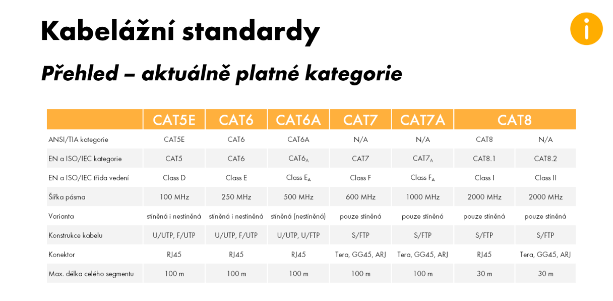

# Fyzická vrstva – měděná kabeláž

## 1. Úvod

- ####  Fyzická vrstva (OSI) je zodpovědná za přenos bitů dat prostřednictvím přenosového média. Jedním z nejrozšířenějších typů přenosového média je měděná kabeláž, která se široce používá v lokálních i globálních sítích.
***
## 2. Typy měděných kabelů

### 2.1. Kroucená dvojlinka (Twisted Pair)

- Nestíněná (UTP – Unshielded Twisted Pair)

- Stíněná (STP – Shielded Twisted Pair)

- Fóliovaná (FTP – Foiled Twisted Pair)

- Dvojité stínění (S/FTP, F/FTP)

- Hlavní použití: Ethernetové sítě (10/100/1000 Mbps, 10GBASE-T)

### 2.2. Koaxiální kabel (Coaxial Cable)

- Středový měděný vodič, dielektrikum, stínění a vnější plášť

- Používán ve starších Ethernetových sítích (10BASE2, 10BASE5)

- Použití v televizním vysílání a širokopásmovém internetu

### 2.3. Telefonní kabel

- Používá se pro přenos analogového a digitálního telefonního signálu (DSL, ISDN)
***
## 3. Charakteristiky měděných kabelů
| Typ kabelu | Úroveň použití | Složení kabelu |
|-----------|-----------------|--------------|
| **Kroucená dvojlinka (UTP, STP, FTP)** | Lokální sítě | 2–4 páry měděných vodičů, izolace, (stínění pro STP, FTP) |
| **Koaxiální kabel** | Širokopásmové sítě, televize | Středový měděný vodič, dielektrikum, opletení, vnější plášť |
| **Telefonní kabel** | Telefonní linky, DSL | 2 měděné vodiče, izolace |
*** 
## 4. Konektory a standardy

- RJ-45 – standardní konektor pro Ethernet

- BNC – konektor pro koaxiální kabel

- RJ-11 – telefonní připojení

- T568A a T568B – zapojení konektorů kroucené dvojlinky
***
## 5. Výhody a nevýhody

### Výhody:

- Dostupnost a nízké náklady

- Snadná instalace

- Podpora vysokých přenosových rychlostí

### Nevýhody:

- Omezená délka kabeláže

- Citlivost na elektromagnetické rušení

- Zastaralost koaxiálních řešení
*** 
## Závěr
- #### Měděná kabeláž zůstává důležitou součástí síťové infrastruktury. Moderní standardy kroucené dvojlinky umožňují přenos dat vysokými rychlostmi, avšak s rozvojem optických vláken a bezdrátových technologií její využití postupně klesá.
*** 

