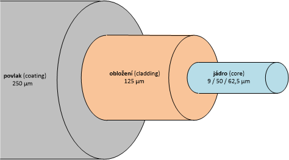

# Fyzická vrstva – optická kabeláž

## 1. Úvod

- ##### Fyzická vrstva modelu OSI je zodpovědná za přenos bitů dat přes přenosové médium. Optické kabely se v moderních sítích používají díky vysoké rychlosti, odolnosti vůči rušení a velké přenosové kapacitě.
***
## 2. Hlavní komponenty optického systému

- Optický kabel – hlavní médium pro přenos dat, využívající světelné impulsy.

- Zdroj světla – obvykle laser nebo LED dioda, která generuje světelné signály.

- Přijímač – fotodetektor, který převádí světelné impulsy na elektrické signály.

- Konektory a spojky – zajišťují spojení kabelů mezi zařízeními.
***
## Složení optického kabelu :

***
## 3. Typy optických kabelů

- Jednomódový (SMF - Single Mode Fiber):

- Používá se pro přenos dat na dlouhé vzdálenosti (až stovky kilometrů).

- Průměr jádra – 8-10 µm.

- Vysoká rychlost přenosu dat.

- Multimódový (MMF - Multi Mode Fiber):

- Používá se na krátké vzdálenosti (do 2 km).

- Průměr jádra – 50-62,5 µm.

- Nižší náklady ve srovnání s jednomódovým vláknem.
*** 
## 4. Výhody optické kabeláže

- Vysoká přenosová kapacita – podpora rychlostí až několika Tbit/s.

- Nízký útlum signálu – přenos dat na velké vzdálenosti bez výrazných ztrát.

- Odolnost vůči elektromagnetickému rušení – neovlivněn vnějšími elektrickými poli.

- Bezpečnost – obtížnost odposlechu činí optická vlákna bezpečnějšími.

- Kompaktnost a lehkost – menší rozměry a hmotnost oproti měděným kabelům.
***
## 5. Nevýhody optické kabeláže

- Vysoké náklady na vybavení a instalaci.

- Složitost montáže a oprav.

- Křehkost optických kabelů.
***
## 6. Použití optických kabelů

- Páteřní sítě (internetoví poskytovatelé, datová centra).

- Lokální sítě podniků a datových center.

- Telekomunikace a širokopásmový přístup.

- Medicínské technologie (endoskopie, laserová chirurgie).
***
## 7. Závěr

- Optické kabely hrají klíčovou roli v moderních telekomunikacích a umožňují vysokorychlostní přenos dat na velké vzdálenosti. Navzdory vysokým nákladům se díky svým výhodám stále více uplatňují v síťové infrastruktuře.
***
