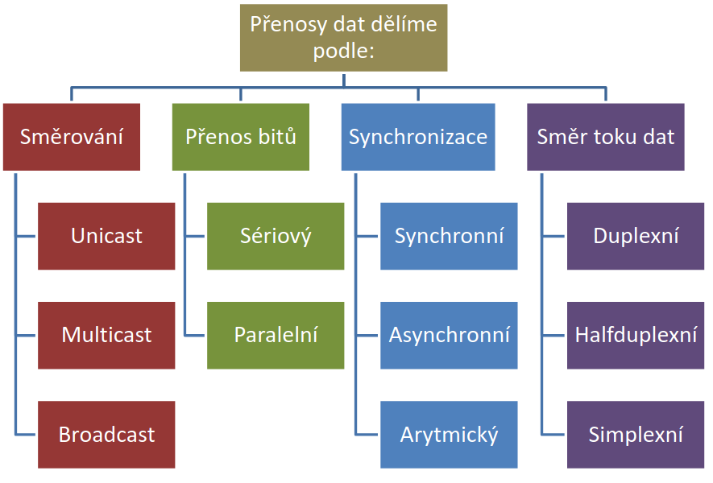
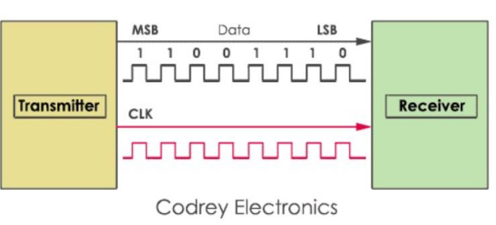
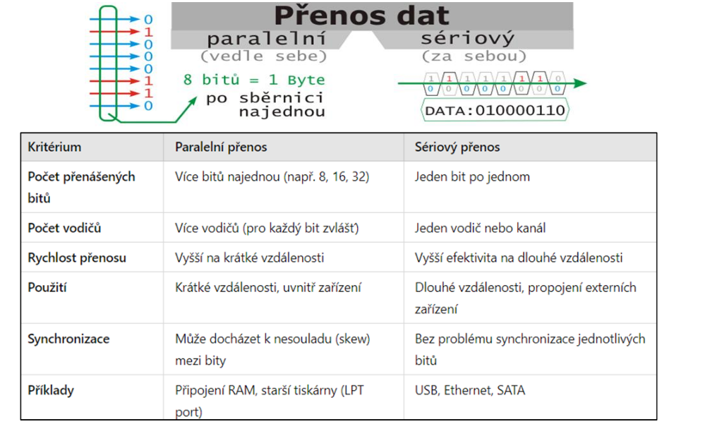
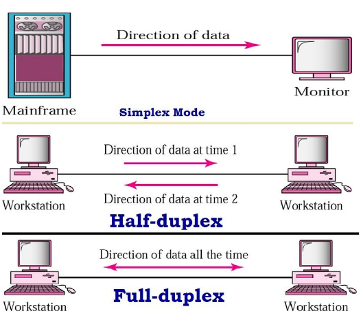
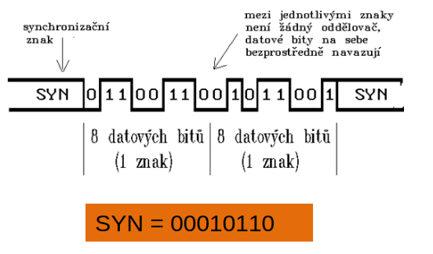
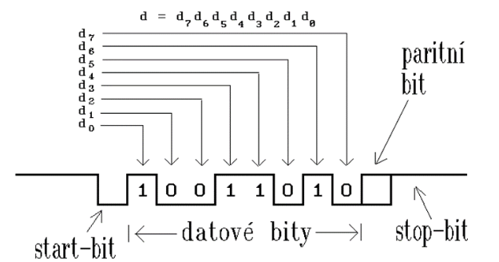

# Přenos dat

## Rozdělení přenosu dat

**Každá síť – od jednoduchého propojení dvou počítačů až po celý internet – funguje na principu přenosu dat.** Data se přenášejí v bitech (0/1) pomocí elektrických, optických nebo bezdrátových signálů

Který přenos je nejlepší v dnešních reálných sítích

- Unicast - je to „**nejčastěji používaný typ**“ komunikace mezi dvěma uzly (klient–server, web, e-mail).
	- Způsob přenosu bitů:
		- V sítích se téměř vždy používá **sériový přenos**
	- Časování:
		- kvůli efektivitě se v praxi preferuje synchronní rámcování bloků (bez režie start/stop bitů)
	- Směr toku:
		- moderní linky běží plně duplexně (současně oběma směry), např. Ethernet
	- Kontrola:
		- CRC

### Podle směrování dat

#### **Unicast**

- Přenos od jednoho odesílatele k jednomu příjemci
- Nejčastější typ komunikace
- Příklad: webový prohlížeč <-> server (HTTP, e-mail)

> Adresace cílového zařízení probíhá pomocí MAC nebo IP adresy

#### **Multicast**

- Přenos od jednoho odesílatele ke skupině vybraných příjemců
- Efektivní pro skupinovou komunikaci
- Příklad: IP televize, online přednášky, streamování

> Využívá rozsah adres `224.0.0.0 - 239.255.255.255` IPv4

#### **Broadcast**

- Přenos od jednoho odesílatele ke všem v síti (v rámci jedné podsítě)
- Výhoda: rychlé rozeslání všem
- Nevýhoda: zatěžuje síť, protože všechna zařízení musí zprávu zpracovat

> Adresace cílového zařízení probíhá pomocí **broadcast MAC nebo IP adresy** 

### Podle přenosu bitů

#### **Paralelní**

- Najednou se přenáší více bitů současně (např. 8 bitů = 1 byte)
- Rychlý, ale pouze na krátkou vzdálenost (**cca do 20 m**)
- Používal se mezi PC a tiskárnou (LPT port)
- **Nevhodný pro sítě – problém se synchronizací a přeslechy(crosstalks)!**
> Paralelní komunikace přenáší 8, 16 nebo 32 bitů dat najednou

#### **Sériový**

- Data se přenášejí bit po bitu po jednom vodiči nebo kanálu
- Nejmenší položka dat přenášenásériově je označována jako znak a má obvykle rozsah 7 nebo 8 bitů
- Pomalejší v jednom taktu, ale spolehlivější a vhodný na větší vzdálenost kvůli synchronizaci času
- **Dnes převládající způsob přenosu ve všech typech sítí**
- Příklad: Ethernet, USB, SATA, Wi-Fi

### SHRNUTÍ

### Podle směru toku dat

#### **Simplexní**

- Jednosměrný
- Staré TV vysílání

#### **Half-duplex**

- Obousměrný, ale ne současně 
- Vysílačky (рации)

#### **Full-duplex**

- Obousměrný současně 

### Podle synchronizace

#### **Synchronní**

- Data se posílají v blocích (rámcích) s pevným rytmem (taktem hodin)
- Není potřeba start/stop bit – vyšší rychlost a efektivita, používá SYN (00010110)
- Odesílatel i příjemce se synchronizují podle „hodinového signálu“, ví kdy začíná a končí každý bit
- **Manchester**

> Konkrétních způsobů, jak sloučit hodinový a datový signál do jednoho výsledného signálu, existuje více. Poněkud nesprávně se tomu říká "kódování".

#### **Asynchronní**

- Data se posílají nepravidelně, znak po znaku – nejsou časově sladěni!
- Každý znak má start bit a stop bit, příjemce tak pozná, kdy zpráva začíná a končí 
- Výhoda: jednoduché 
- Nevýhoda: nižší efektivita 

#### **Arytmický**

- Mezistupeň mezi synchronním a asynchronním
- Vysílač i přijímač mají vlastní hodiny, které se při startu synchronizují
- Nesdílejí společný takt, proto se každý znak rámuje zvlášť: začíná start bitem (0), následují datové bity (typicky 5–8), volitelný paritní bit a končí stop bitem (1), mezi znaky mohou být mezery
- Používá se tam, kde není nutná plná synchronizace.