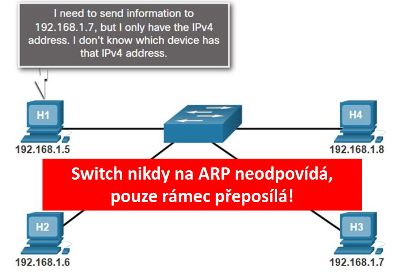

# ARP (Address Resolution Protocol)

## Účel a princip fungování

- ARP slouží k překladu logických IP adres na fyzické MAC adresy v rámci lokální sítě
- Zatímco aplikace komunikují pomocí IP adres např technologie Ethernet doručuje data na linkove vrstvě pouze pomocí MAC adres
- Analogie:
  - IP adresa je jako jméno kamaráda ale MAC adresa je jeho konkrétní bydliště;
  - pošťák (ARP) musí zjistit adresu, aby mohl dopis doručit

## Mechanismus komunikace

1. **ARP Request**
   - Pokud odesílatel (H1) nezná MAC adresu cíle (H3), pošle do sítě broadcast s dotazem: „Kdo má IP 192.168.1.7? Pošli mi svou MAC“
   - Každá síťová karta přijme rámec pouze tehdy, pokud má cílovou MAC adresu stejnou jako její vlastní, nebo jde o broadcastovou adresu `FF:FF:FF:FF:FF:FF`
2. **ARP Reply**
    - Cílové zařízení (H3) odpoví pomocí unicastu (přímo odesílateli): „Já mám IP 192.168.1.7, moje MAC je...“
3. **ARP Cache**
   - Odesílatel si uloží odpověď do ARP tabulky, aby příště mohl komunikovat přímo bez dalšího dotazování
   

## ARP v různých scénářích

- LAN:
  - ARP dotaz směřuje přímo na cílové zařízení v téže síti
- Internet:
  - Pokud je cíl v jiné síti, odesílatel musí poslat data na **Default Gateway:**
    - PC-A zjistí, že cílová IP (např. 10.1.1.10) je v jiné síti, a proto data směřuje na bránu 192.168.1.1
    - PC-A pošle broadcast s dotazem: „Kdo je 192.168.1.1?“
    - Router (R1) odpovídá unicastem a pošle svou MAC adresu (00-0D)
    - PC-A vytvoří Ethernet rámec, kde jako cílovou MAC nastaví adresu routeru (00-0D)
    - V IP paketu uvnitř rámce zůstává jako cíl skutečná adresa v internetu (10.1.1.10)
      - Jakmile router (R1) rámec přijme, provede jeho „přezabalení“
      - Router úplně zahodí (odstraní) původní Ethernetovou hlavičku, která obsahovala MAC adresu odesílatele a MAC adresu routeru
      - Vnitřní část (IP paket) zůstává nezměněna – zdrojová i cílová IP adresa se nemění
      - Router vytvoří zcela novou L2 hlavičku (rámec) pro další skok na cestě k cíli
      - Router se podívá do své směrovací tabulky a pokud nezná MAC adresu dalšího skoku (next hop), pošle vlastní ARP Request do dané sítě
      - V nové hlavičce nastaví jako zdrojovou MAC adresu svého odchozího rozhraní a jako cílovou MAC adresu dalšího routeru nebo koncového zařízení
- L2 Switch:
  - Pouze přeposílá ARP rámce
  - Sám na ně neodpovídá a nevede ARP tabulku (používá tabulku MAC adres – CAM)
> Každé síťové zařízení si svou ARP tabulku ukládá lokálně ve své operační paměti (RAM), kde jsou záznamy uchovávány dočasně pro rychlý přístup při odesílání dat

## Bezpečnostní rizika a ochrana

- ARP je velmi naivní protokol, který věří každé odpovědi, což vede k riziku ARP Spoofingu (útočník předstírá, že je router)
- To se využívá pro odposlech (**sniffing**), **Man-in-the-Middle** útoky nebo **DoS útoky**

### Obranné konfigurace na Cisco (L2/L3 switch)

- K eliminaci těchto útoků se používá kombinace funkcí, které ověřují legitimitu ARP rámců:
  - DHCP Snooping (nezbytný základ pro DAI):
    - `ip dhcp snooping` - zapne funkci globálně
    - `ip dhcp snooping vlan 10` - aktivuje sledování pro konkrétní VLAN
    - `ip dhcp snooping trust` - (v režimu rozhraní) nastaví port jako důvěryhodný pro DHCP server
  - Dynamic ARP Inspection (DAI):
    - `ip arp inspection vlan 10` - zapne kontrolu ARP odpovědí proti DHCP databázi
  - Port Security (omezení počtu MAC adres na portu):
    - `switchport port-security` - zapne funkci na portu
    - `switchport port-security maximum 2`- omezí počet povolených adres
    - `switchport port-security violation restrict` - definuje akci při porušení pravidel
  - Statické ARP záznamy (pro kritická zařízení):
    - Pro servery nebo brány lze mapování IP a MAC nastavit "natvrdo", aby jej nebylo možné přepsat útokem:
      - Windows: `arp -s 192.168.1.100 00-11-22-33-44-55`
      - Limux: `ip neigh add 192.168.1.10 lladdr 00:11:22:33:44:55 dev eth0 nud permanent`