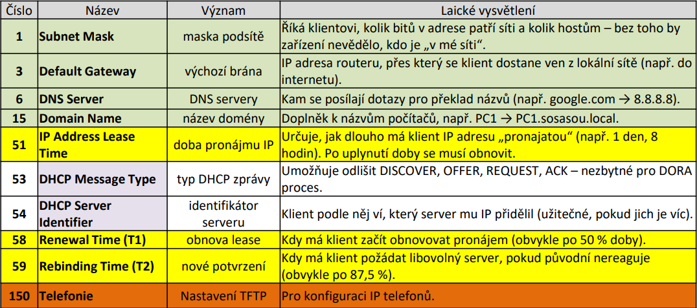

# DHCP (Dynamic Host Configuration Protocol)

## Co je to DHCP

- DHCP (Dynamic Host Configuration Protocol) automatizuje přidělování IP adresy, masky, výchozí brány (default gateway), DNS serverů a dalších parametrů síťovým zařízením
- Ruční nastavování IP adres na stovkách zařízení je nerealistické kvůli vysoké chybovosti, riziku kolizí adres a celkové neohebnosti správy
- Po odpojení hostitele se IP adresa vrací zpět do fondu adres (poolu) pro další využití
- Funguje nad protokolem **UDP** na portech **67 (server)** a **68 (klient)**. Ve výchozím stavu používá broadcasty, které bez relay agenta nepřekročí hranici L2 (router/VLAN)

## Architektura a terminologie

- DHCP klient: Zařízení (PC, telefon, router), které žádá o adresu
- DHCP server: Typicky router, L3 přepínač nebo dedikovaný server (např. Windows Server)
- Pool: Definovaný rozsah IP adres pro danou síť.
- Exclusions (Vyloučení): Adresy, které server nesmí přidělovat (např. pro brány, tiskárny, servery)
- Lease (Pronájem): Časově omezené zapůjčení adresy (dny, hodiny, minuty)
- Reservation (Rezervace): Pevné přiřazení konkrétní IP adresy konkrétní MAC adrese

## DORA

- **Komunikace mezi klientem a serverem probíhá ve čtyřech krocích:**

1. **D - DISCOVER**: Klient vysílá broadcast a hledá dostupný DHCP server [_broadcast_]
2. **O - OFFER**: Server nabízí volnou IP adresu klientovi [_broadcast_]
3. **R - REQUEST**: Klient si oficiálně vyžádá nabízenou adresu (opět broadcastem, aby ostatní servery věděly, že jejich nabídky nebyly vybrány) [_broadcast_]
4. **A - ACK**: Server potvrdí přidělení, zašle doplňující parametry (Options) a potvrdí dobu pronájmu [_unicast_]

## Metody přidělování adres

1. **Dynamické**: Dočasný pronájem (lease); po vypršení může klient dostat jinou IP
2. **Automatické**: Server si zapamatuje vazbu MAC-IP a klientovi přidělí vždy stejnou adresu, která se už nevrací do poolu
3. **Manuální (Rezervace)**: Správce pevně sváže IP s MAC adresou (vhodné pro servery a tiskárny)

## DHCP Options

---

## Konfigurace na Cisco IOS

- Vyloučení adres: `ip dhcp excluded-address [low-address] [high-address]`
- Vytvoření poolu: `ip dhcp pool [name]`
- Nastavení parametrů v poolu:
  - definice sítě: `network [address] [mask]`
  - výchozí brána: `default-router [address]`
  - adresa DNS: `dns-server [address]`
  - doba pronájmu: `lease [days hours minutes]`
- DHCP Relay Agent: `ip helper-address [IP_serveru]`
- Zobrazí aktuálně pronajaté adresy: `show ip dhcp binding`
- Statistiky zpráv (Discover, Request atd.): `show ip dhcp server statistics`
- Příkazy pro uvolnění a znovuzískání adresy na Windows: `ipconfig /release` & `ipconfig /renew`
> cisco switches (v paket traceru) nepodporuji lease

## DHCP Relay Agent

- Pokud je server v jiné síti (za routerem), broadcasty k němu nedorazí
- Na rozhraní routeru směřujícím ke klientům se nastaví příkaz ip helper-address [IP_serveru]
- Router pak přeposílá DHCP broadcasty jako unicast přímo na server

## Bezpečnost a problémy

- Rizika:
  - **Rogue DHCP**: Nežádoucí server v síti podvrhující špatnou bránu/DNS.
  - **DHCP Starvation**: Útok zaměřený na vyčerpání všech adres v poolu.
- **Obrana (DHCP Snooping)**: Funkce na switchích, která rozlišuje důvěryhodné (trusted) porty pro server a nedůvěryhodné pro uživatele
- **Problémy s HSRP**: V Packet Traceru/IOS se DHCP server neváže na stav HSRP; oba routery mohou odpovídat současně a způsobovat konflikty