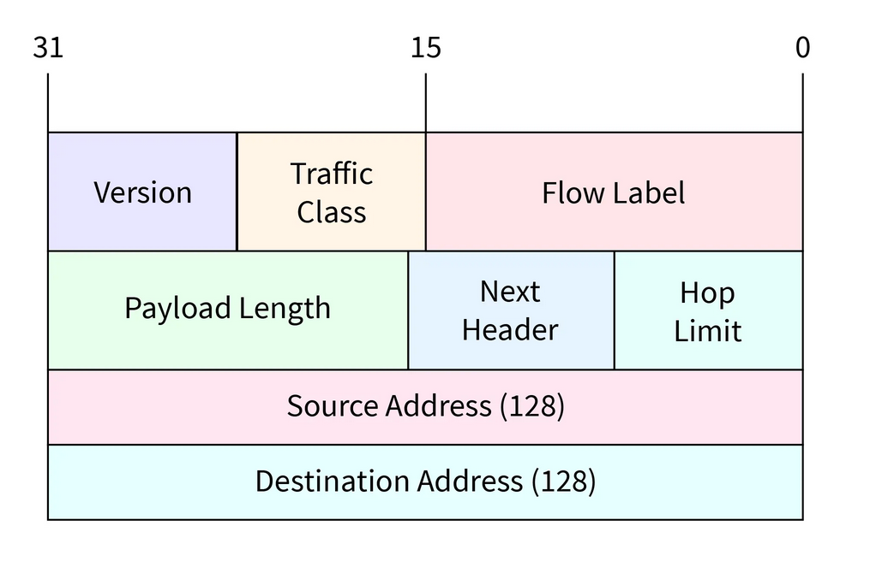

# Základy IPv6

**IPv6** je nová verze internetového protokolu, která byla vytvořena jako nástupce dosluhujícího IPv4. Hlavním důvodem je fakt, že staré adresy prostě došly

### Klíčové parametry:

- **Délka adresy:** **128 bitů** (IPv4 má pouze 32 bitů)
- Teoreticky 2^128 adres. To je nepředstavitelné množství, které pokryje potřeby lidstva na desítky let dopředu
- Hexadecimální soustava, 8  **hextetu** oddělených dvojtečkou(např. `2001:0db8:85a3:0000:0000:8a2e:0370:7334`)

### Proč nahrazuje IPv4

- **Vyčerpání adres:**
	- Adresy IPv4 (~ 4,3 miliardy) jsou již v podstatě rozebrané
- **Rychlejší směrování:**
	- IPv6 má jednodušší hlavičku paketu, což snižuje zátěž pro routery
- **Bezpečnost:**
	- Protokol **IPsec** je v IPv6 nativně podporován, což zvyšuje bezpečnost komunikace
- **Konec NAT:**
	- Díky obrovskému počtu adres může mít každé zařízení (lednička, auto, telefon) svou vlastní veřejnou IP adresu bez nutnosti překladu adres (NAT)

## Zkracování IPv6 adres

- Zkracování je možné díky velkému počtu nul v adresách, ale musí se řídit těmito pravidly:
	- **Vynechání počátečních nul:**
		- V každém hextetu je možné vynechat nuly, které stojí na začátku. Blok samých nul lze zapsat jako jednu nulu
		- `0123:5310:0000:0000:0000:00fe:ab48:3310` → `123:5310:0:0:0:fe:ab48:3310` 
	- **Použití symbolu „::“:**
		- Souvislou řadu nulových bloků lze nahradit dvojtečkou „::“.
		- `0123:5310:0000:0000:0000:00fe:ab48:3310` → `123:5310::fe:ab48:3310`
	- **Pozor na pozici nuly:**
		- **Nulu na konci nebo uprostřed bloku nelze vynechat.**
		- Pokud byste z `:5310:` udělali `:531:`, znamenalo by to původně `:0531:`
	- **Unikátnost „::“:**
		- **Tento symbol se smí v adrese použít pouze jednou**
		- Pokud by byl použit vícekrát (např. `123::123::`), nebylo by možné zpětně dopočítat, kolik nulových bloků patří do které mezery

## Typy adresování v IPv6

#### Unicast (Jeden jednomu)

- Paket je odeslán z jednoho rozhraní na **jedno konkrétní** rozhraní

#### Multicast (Jeden skupině)

- Paket je odeslán na adresu multicastové skupiny.
- Doručí se **všem rozhraním**, která se k této skupině přihlásila

#### **Anycast** (Jeden nejbližšímu)

- Anycast je technologie, kde více serverů sdílí stejnou IP adresu, ale tvůj požadavek dorazí vždy jen k tomu jednomu, který je k tobě síťově nejblíže

## Prefixy

- Prefix určuje hranici mezi **sítí** a **hostitelem**
- Zapisuje se za lomítkem (např. `/64`) a udává počet bitů zleva, které jsou pevně dané pro danou úroveň sítě

### Úrovně sítě

- **`/32` (Provider Block):**
	- Obrovský rozsah pro ISP
	- Umožňuje mu spravovat miliony zákazníků
- **`/48` (Site Prefix):**
	- Standardní příděl pro firmu nebo lokalitu
	- Zákazník má **16 bitů** volných pro vlastní podsítě (64−48=16), což znamená **65 536** podsítí typu `/64`
- **`/64` (Subnet ID):**
	- Základní jednotka. Nejpřesnější směrovací prefix
	- Prvních 64 bitů je adresa sítě, zbývajících 64 bitů je identifikátor zařízení (např. vygenerovaný z MAC adresy přes EUI-64)
- `/128` (Host Address):
	- Označuje jedno konkrétní rozhraní (používá se například pro Loopback)

## Rozdělení IPv6 adres podle dosahu

### 1. Global Unicast Address (GUA)

- Jsou unikátní v celém internetu
- V současnosti začínají číslicí **`2`** nebo **`3`** (např. `2001:db8...`)
- Pro komunikaci v rámci celého internetu

### Link-Local address (LLA)

- Adresy určené pouze pro komunikaci v rámci jedné fyzické sítě (jednoho kabelu nebo Wi-Fi)
- Vždy začínají prefixem **`fe80::/10`**
- Každá síťová karta v IPv6 **musí** mít Link-Local adresu, i kdyby neměla internet. Používá se pro hledání sousedů (NDP)

### Loopback address

- Adresa, kterou zařízení používá pro komunikaci „samo se sebou“ (nejvic pro testování)
- V IPv6 je to **`::1/128`** (odpovídá IPv4 adrese `127.0.0.1`)

## IPv6 Datagram

- **Version (4 bity):** 
	- Označuje verzi protokolu. Pro IPv6 je zde vždy hodnota `6` (binárně `0110`)
- **Traffic Class (8 bitů):**
	- Slouží k prioritizaci provozu (QoS). Pomáhá routerům poznat, který paket má přednost (např. hlasový hovor má přednost před stahováním souboru)
- **Flow Label (20 bitů):**
	- Označuje sekvenci paketů (tok), aby routery nemusely každý paket zkoumat samostatně, ale mohly je zpracovat jako jeden proud 
- **Payload Length (16 bitů):** 
	- Určuje velikost dat, která jsou „přibalena“ za touto hlavičkou (v bajtech)
- **Next Header (8 bitů):**
	- Určuje, co následuje hned za touto hlavičkou – buď další rozšiřující hlavička, nebo protokol vyšší vrstvy (např. TCP nebo UDP)
- **Hop Limit (8 bitů):**
	- Podobné jako TTL u IPv4. Určuje maximální počet „skoků“ přes routery.Každý router odečte 1; pokud je nula, paket se zahodí (ochrana proti nekonečným smyčkám)
- **Source Address (128 bitů):**
	- Úplná adresa odesílatele
- **Destination Address (128 bitů):**
	- Úplná adresa příjemce

> Pro srovnání ipv4 datagram ma minimálně **20 bajtů** a ipv6 datagram ma **40 bajtů**. Je dvakrát větší než minimální IPv4, protože samotné adresy v IPv6 zabírají 32 bajtů (16 pro odesílatele, 16 pro příjemce)

---

> trochu později doplnit informace z prezentace