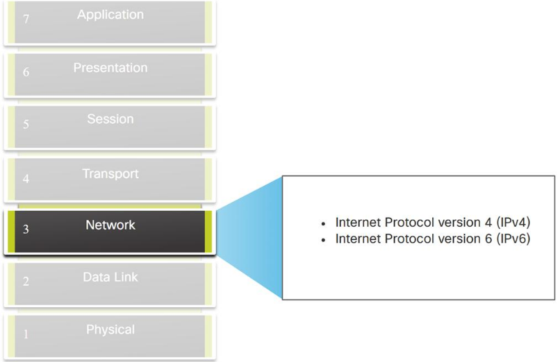
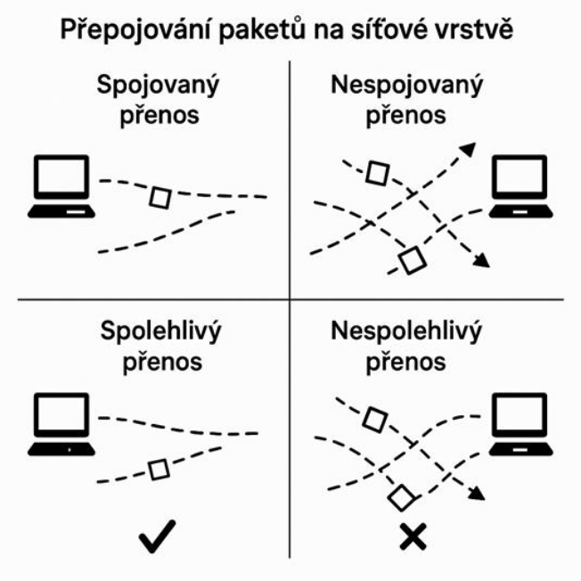
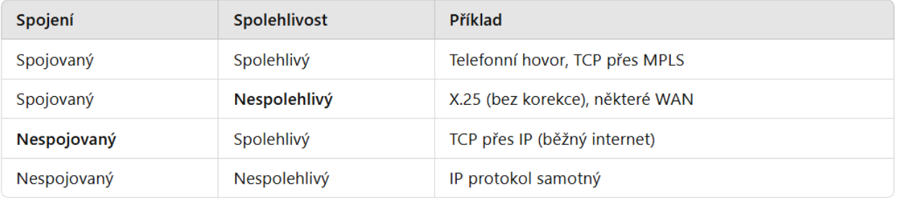
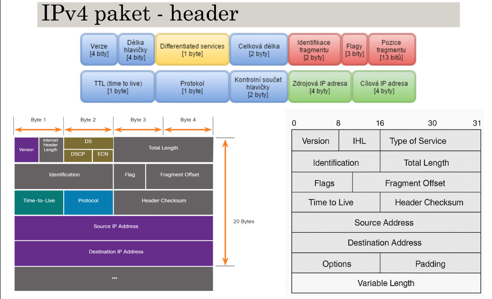

# Síťová vrstva (Layer 3)

**Síťová vrstva neboli OSI vrstva L3, poskytuje služby, které umožňují koncovým
zařízením vyměňovat si data napříč sítěmi.**

## PDU na síťove vrstve

- Datagram - je konkrétní typ paketu používaný u nespojovaného přenosu. IPv4
pracuje s datagramy, a to je správný technický termín.
- Paket (packet) - je obecný výraz pro jednotku dat, která se přenáší po síti.
- "Paket“ může být:
  - datagram (v nespojované síti), paket (ve spojované síti),
  - frame (na linkové vrstvě),
  - segment (v TCP),nebo prostě „něco, co nese data“.
> V běžné praxi se slangově říká "paket" i tehdy, když jde technicky o datagram,
podobně jako říkáme „USBčko“, i když myslíme flash disk.

## Způsoby přenosu dat

1. Spojovaný přenos (connection-oriented)
- Před přenosem se vytvoří virtuální spojení.
- Všechny pakety jdou stejnou cestou.
- Výhody: kontrola pořadí, stabilita, méně chyb.
- Příklad: MPLS, TCP (vrstva 4).

2. Nespojovaný přenos (connectionless)
- Pakety jsou odesílány nezávisle, každý může jít jinudy.
- **Není zaručeno** doručení ani pořadí.
- Výhody: jednodušší, rychlejší, méně režie.
- Příklad: IP (IPv4/IPv6), UDP.

### Možné způsoby fungování síťové vrstvy

1. Přepojování paketů (packet switching)
- Data jsou rozdělena na pakety (datagramy), které se posílají jednotlivě.
- Každý paket obsahuje:
  - **adresu odesílatele**
  - **adresu příjemce**
  - **číslo paketu**
  - případně další metadata
- Pakety mohou putovat různými cestami sítí (na rozdíl od spojového přenosu - okruhy).
- Na cílové straně se pakety znovu složí (nebo také nemusí – záleží na vyšší vrstvě).
- Možné kombinace přenosu:

## Hlavní úkoly síťové vrstvy

1. Směrování (routing)
- Určuje nejvhodnější cestu, kterou se data (datagramy) dostanou od zdroje k cíli přes různé sítě.
- Rozhodování probíhá na základě směrovacích tabulek, které obsahují známé sítě a cesty k nim.
- Router vybírá cestu podle směrovacích protokolů (např. RIP, OSPF, BGP).
- Směrování může být:
  - Statické – cesty nastaví administrátor ručně.
  - Dynamické – routery si cesty vyměňují automaticky pomocí protokolů.
- Cíl: najít nejrychlejší nebo nejefektivnější trasu.

2. Předávání (forwarding)
- Proces fyzického odeslání paketu na další síťové zařízení podle směrovací tabulky.
- Router:
  - Přečte cílovou IP adresu z hlavičky datagramu.
  - Vyhledá, kudy má paket poslat (další hop).
  - Pošle ho na odpovídající rozhraní.
- Forwarding se provádí na každém routeru po cestě.
> hop (skok) - Je to počet routerů, kterými paket musí projít, než dorazí do cíle.
- Cíl: zajistit, aby se každý paket posouval krok po kroku směrem ke svému cíli.

3. QoS (Quality of Service – kvalita služeb)
- Mechanismus, který určuje, jakou prioritu mají různé typy dat.
- Např. videohovor musí mít přednost před stahováním souboru, aby se nesekal.
- Používá se pole DS (Differentiated Services) v hlavičce IP.
- Router podle QoS:
  - Rozpozná typ provozu.
  - Přednostně zpracuje důležité pakety.
  - Omezuje méně důležité přenosy (např. zálohování).
- Cíl: zachovat plynulý přenos u citlivých dat (hlas, video).

4. Řízení zahlcení (congestion control)
- Řeší situace, kdy je síť přetížená (router nestíhá přenášet všechny pakety).
- Při zahlcení se mohou:
  - ztrácet pakety
  - zvyšovat zpoždění
  - vznikat fronty v routerech
- Protokoly nebo zařízení mohou omezit rychlost odesílání dat, aby se síť uvolnila.
- Používá se například u TCP nebo ve směrovacích algoritmech.
- Cíl: zabránit „ucpání“ sítě a kolapsu přenosu.

## Operace protokolů síťové vrstvy

1. Adresování
   - každé zařízení má unikátní IP.

2. Zapouzdření (encapsulation)
   - přidání hlavičky IP k datům z transportní vrstvy.

3. Směrování
   - výběr trasy přes routery (každý přeskok = hop).

4. Rozpouzdření (De-encapsulation)
   - odstranění hlavičky na cíli.

## Protokoly síťové vrstvy (TCP/IP model)

- **IPv4** – 32bitové adresy.
- **IPv6** – 128bitové adresy.
- **ICMP** – diagnostika (ping, traceroute).
- **IGMP / MLD** – multicast správa.
- **ARP / NDP** – převod IP↔MAC.
- **BGP, OSPF, RIP, EIGRP** – směrovací protokoly.

## Protokol IP – vlastnosti

- **Nespojovaný** – žádné předem vytvořené spojení.
- **Best Effort** – bez záruky doručení (nespolehlivý).
- **Nezávislý na médiu** – funguje přes měď, optiku i Wi-Fi.
- **Bez kontroly chyb** – to dělá TCP.

## MTU (Maximum Transmission Unit)

- Největší rámec, který může být přenesen přes médium.
- Ethernet ≈ 1500 B.
- Pokud je paket větší než MTU, musí dojít k **fragmentaci**.

## Fragmentace (IPv4)

- Rozdělení velkého paketu na menší části.
- Každý fragment má vlastní hlavičku.
- IPv6 neumožňuje fragmentaci routery.
- Zpomaluje přenos → proto se jí dnes vyhýbáme.

## MTU Discovery

- Metoda pro zjištění nejmenší MTU na trase.
- Používá flag DF (Don’t Fragment) = 1.
- Router, který nemůže přeposlat paket, pošle chybu “Packet too big”.

## IPv4 datagram (header)

- **Verze** – obsahuje 4bitovou binární hodnotu nastavenou na 0100, která identifikuje tento paket jako paket IPv4
- **IHL** – délka hlavičky, dnes max. 20 byte (dříve to mohlo být jinak)
- **Differentiated Services (DS)** – je 8bitové pole používané k určení priority každého paketu, dnes známe spíše
jako QoS (Quality of Service)
- **Total Lenght** – délka datagramu v bytech
- **Identification** - pokud byl datagram při přepravě fragmentován, pozná se, které fragmenty patří k sobě (mají
stejný identifikátor)
- **Flag (příznaky)** – slouží pro řízení fragmentace, máme DF=1 (nesmí fragmentovat a MF=1 (fragment není
poslední)
- **Fragment offset** - udává, na jaké pozici v původním datagramu začíná tento fragment. Důležité k sestavení
paketu!
- **Time to Live (TTL)** – obsahuje 8bitovou binární hodnotu, která se používá k omezení životnosti paketu.
- **Protokol** – toto pole se používá k identifikaci protokolu další úrovně. Mezi běžné hodnoty patří ICMP (1), TCP (6)
a UDP (17).
- **Header Checksum (kontrolní součet záhlaví)** – slouží ke zjištění poškození v hlavičce protokolu IPv4
- **Zdrojová IPv4 adresa** – obsahuje 32bitovou binární hodnotu, která představuje zdrojovou IPv4 adresu paketu.
Zdrojová adresa IPv4 je vždy adresa unicastového vysílání.
- **Cílová IPv4 adresa** – obsahuje 32bitovou binární hodnotu, která představuje cílovou IPv4 adresu paketu

## TTL – Time To Live

- Zabraňuje nekonečnému kroužení paketů.
- Každý router TTL − 1.
- Když TTL = 0 → paket se zahodí a pošle se ICMP „Time Exceeded“.
- Použití: traceroute – zjištění cesty paketů přes síť.

> ## Omezení IPv4
> 
> - Vyčerpání adres (pouze ≈ 4 miliardy).
> - Nedostatek end-to-end konektivity kvůli NAT.
> - Větší složitost sítí → NAT způsobuje zpoždění a komplikace.