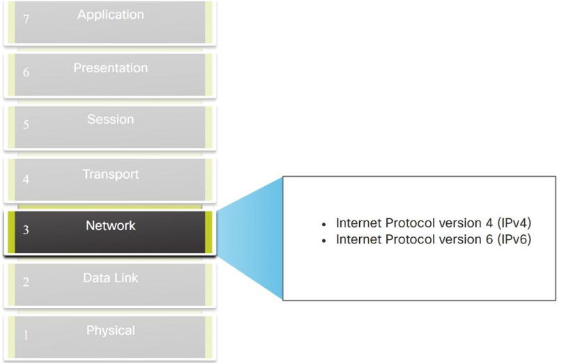
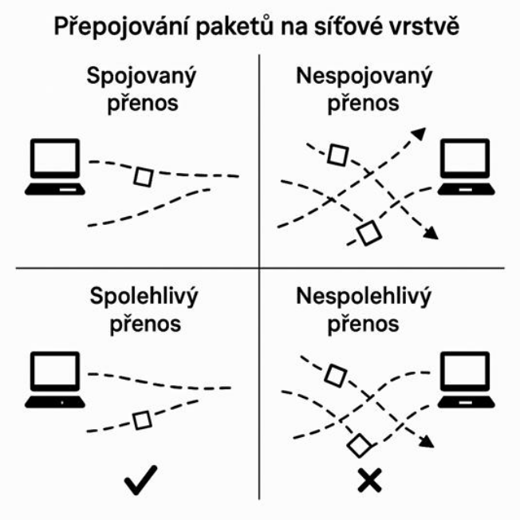
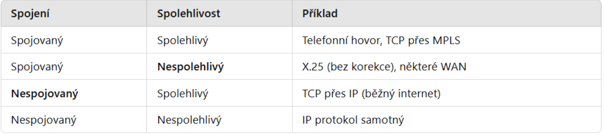
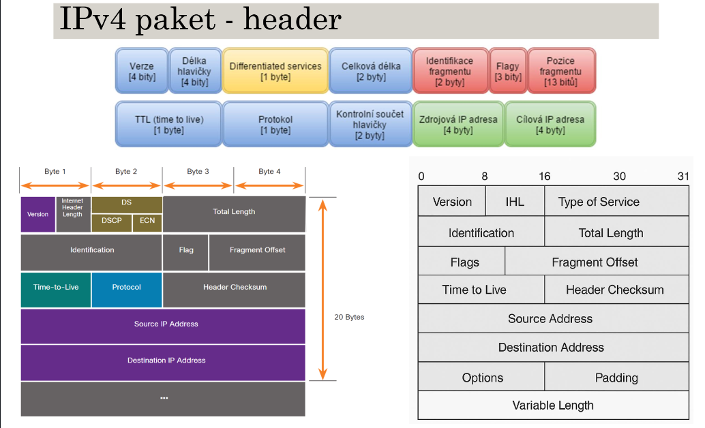

# Síťová vrstva (Layer 3)

**Síťová vrstva neboli OSI vrstva L3, poskytuje služby, které umožňují koncovým zařízením vyměňovat si data napříč sítěmi.**[cite: 2]

## PDU na síťové vrstvě

- **Datagram:** Je konkrétní typ paketu používaný u nespojovaného přenosu IPv4 pracuje s datagramy, což je správný technický termín
- **Paket (packet):** Je obecný výraz pro jednotku dat, která se přenáší po síti "Paket“ může být: datagram (v nespojované síti), paket (ve spojované síti), frame (na linkové vrstvě) nebo segment (v TCP)
> V běžné praxi se slangově říká "paket" i tehdy, když jde technicky o datagram, podobně jako říkáme „USBčko“, i když myslíme flash disk

## Způsoby přenosu dat

1. **Spojovaný přenos (connection-oriented)**
- Před zahájením přenosu se vytvoří spojení (virtuální cesta) od odesílatele k příjemci
- Všechny pakety jdou stejnou cestou a mají identifikátor cesty
- Výhody: větší kontrola, stabilita, méně problémů s pořadím paketů
- Příklad: MPLS (na síťové vrstvě), TCP (na transportní vrstvě)

2. **Nespojovaný přenos (connectionless)**
- Přenášený blok se označuje jako datagram a pakety jsou posílány nezávisle (každý blok má ve své hlavičce celou adresu příjemce)
- Každý paket může jít jinou cestou, cesty se hledají v každém směrovači znovu
- Síť negarantuje doručení, pořadí ani že vůbec dorazí
- Výhody: jednodušší, rychlejší, méně režie (overhead)
- Příklad: IP (IPv4/IPv6) je nespojovaný a nespolehlivý protokol

### Možné kombinace přenosu[cite: 2]:
- **Spojovaný + Spolehlivý:** Telefonní hovor, TCP přes MPLS
- **Spojovaný + Nespolehlivý:** X.25, některé WAN sítě
- **Nespojovaný + Spolehlivý:** TCP přes IP (běžný internet)
- **Nespojovaný + Nespolehlivý:** Samotný protokol IP

### Přepojování paketů (packet switching)
- Data jsou rozdělena na pakety (datagramy), které se posílají jednotlivě
- Každý paket obsahuje adresu odesílatele, adresu příjemce a číslo paketu
- Pakety mohou putovat různými cestami (na rozdíl od přepojování okruhů)
- Na cílové straně se pakety znovu složí, nebo také nemusí – záleží na vyšší vrstvě

## Hlavní úkoly síťové vrstvy

1. **Směrování (routing):** Rozhodování o cestě a volba směru k cíli přes mezilehlé sítě Může být řešeno centrálně
2. **Předávání (forwarding):** Cílené předávání jednotlivých paketů na další uzel (směrovač) Obojí obvykle řeší router, ale funkce mohou být odděleny
3. **QoS (Quality of Service):** Zajištění podpory kvality služeb, obvykle ve spolupráci s transportní vrstvou
4. **Předcházení zahlcení (congestion control):** Eliminace stavů, kdy je síť zahlcena a nestíhá přenášet všechny pakety
5. **Řízení toku (flow control):** Předcházení tomu, aby odesílatel zahltil příjemce v sítích s přepojováním paketů

## Operace protokolů síťové vrstvy

1. **Adresování:** Koncová zařízení musí být nakonfigurována s unikátní IP adresou pro identifikaci v síti
2. **Zapouzdření (Encapsulation):** Zdrojový hostitel zapouzdřuje data (PDU z L4) do IP paketu a přidává hlavičky
3. **Směrování (Routing):** Směrovače vybírají nejlepší cestu. Každý směrovač po cestě je tzv. skok (hop)
4. **Rozpouzdření (De-encapsulation):** Cílový hostitel zkontroluje IP adresu, odstraní hlavičku IP a předá data transportní vrstvě

## Protokoly síťové vrstvy (TCP/IP model)

- **IPv4:** Starší, ale stále široce používaný protokol, 32bitové adresy
- **IPv6:** Novější verze, 128bitové adresy
- **ICMP:** Používán pro chybová hlášení a diagnostiku (ping, traceroute)
- **IGMP (IPv4) / MLD (IPv6):** Správa multicastových skupin
- **ARP:** Převod IP adresy na MAC adresu v lokálních IPv4 sítích
- **NDP (Neighbor Discovery Protocol):** Nahrazuje ARP u IPv6 a nabízí další funkce
- **IGP (Vnitřní směrovací protokoly):** OSPF, RIP, EIGRP
- **EGP (Vnější protokoly):** BGP (Border Gateway Protocol) – směrování mezi autonomními systémy na internetu

## Protokol IP – vlastnosti

- **Nespojovaný:** Před odesláním dat nevytváří spojení. Komunikace je jako odeslání dopisu bez upozornění příjemce
- **Best Effort (Nejlepší snaha = nespolehlivost):** Nezaručuje doručení ani správné pořadí. Poškozené pakety nejsou odesílány znovu (spolehlivost řeší TCP)
- **Nezávislý na médiu:** Pracuje nezávisle na tom, zda data cestují po optice, mědi nebo bezdrátově

## MTU (Maximum Transmission Unit)

- Linková vrstva stanovuje MTU, což je největší možná velikost datového rámce pro dané médium
- U Ethernetu je běžně MTU 1500 bajtů
- MTU zahrnuje užitečná data (payload) a hlavičky linkové vrstvy, ale *nezahrnuje* hlavičky vyšších vrstev (IP, TCP)

## Fragmentace a PMTUD

- **Fragmentace (jen IPv4):** Pokud musí router předat paket přes médium s menší MTU, paket se rozdělí na fragmenty Způsobuje to režii a latenci, proto se od ní upouští IPv6 routery nefragmentují vůbec
- **Příklad vynucení chyby:** Parametr `-f` u pingu (např. `ping -f -l 2000 www.seznam.cz`) nastaví příznak DF=1 (Don't Fragment) Pokud přesáhne MTU sítě, router jej zahodí a vrátí ICMP zprávu `Packet needs to be fragmented but DF set`
- **PMTUD (Path MTU Discovery):** Odesílatel pošle paket s nastaveným příznakem DF=1 Router, kde paket neprojde, jej zahodí a vrátí zprávu ICMP „Packet too big“ včetně hodnoty lokálního MTU Odesílatel následně velikost zmenší

## IPv4 datagram (header)

Hlavička má standardně velikost 20 bajtů 
- **Verze (4 bity):** Hodnota 0100 určuje IPv4
- **Délka hlavičky (IHL - 4 bity):** Dnes max. 20 bajtů
- **Differentiated Services / DS (8 bitů):** Pole pro QoS k určení priority
- **Celková délka / Total Length (2 byty):** Délka datagramu
- **Identifikace (2 byty):** Stejný identifikátor (ID) pro všechny fragmenty rozděleného paketu
- **Příznaky / Flags (3 bity):** Řízení fragmentace. DF=1 (nesmí fragmentovat), MF=1 (toto není poslední fragment)
- **Pozice fragmentu / Fragment offset (13 bitů):** Kde v původním datagramu začíná tento kousek (udává se v 8bajtových jednotkách)
- **TTL (1 byte):** Omezení životnosti paketu počtem přeskoků
- **Protokol (1 byte):** Identifikuje vložený protokol (ICMP = 1, TCP = 6, UDP = 17)
- **Kontrolní součet hlavičky (2 byty):** Detekce poškození záhlaví
- **Zdrojová a Cílová IP adresa (4 byty / 32 bitů každá):** Zdrojová adresa je vždy unicastová

## TTL – Time To Live

- Slouží jako ochrana proti nekonečnému zacyklení paketů v síti (např. při chybě v routovací tabulce)
- Každý router, kterým paket projde, sníží TTL o 1
- Pokud TTL klesne na 0 a paket ještě není v cíli, router paket zahodí a pošle odesílateli ICMP chybovou zprávu Typ 11 (Time Exceeded), kód 0
- **Využití (Traceroute):** Nástroj úmyslně posílá pakety s hodnotou TTL = 1, pak 2, pak 3... a získává odpovědi od routerů po cestě, čímž mapuje celou trasu Traceroute odesílá testovací pakety standardně o velikosti 60 bajtů

## Omezení IPv4 a příchod IPv6

**Hlavní problémy IPv4:**
1. **Vyčerpání adres:** K dispozici je pouze cca 4 miliardy adres a hrozí absolutní vyčerpání
2. **Nedostatek end-to-end konektivity:** Používání NAT skrývá reálné adresy hostitelů za jedinou veřejnou IP
3. **Zvýšená složitost sítě:** NAT prodloužil životnost IPv4, ale vytváří komplikace, latenci a ztěžuje řešení problémů

**Vylepšení v IPv6:**
- **Adresování a směrování:** 128bitové adresy umožňují obrovský rozsah, lepší hierarchii a menší směrovací tabulky v internetu
- **Automatická konfigurace:** Nativní podpora pro SLAAC bez nutnosti DHCP serverů
- **Zabezpečení:** IPsec je standardní a povinnou součástí
- **Žádný NAT:** Návrat k přímé end-to-end komunikaci
- **Efektivnější práce s pakety:** Jednodušší hlavička zrychluje práci routerů (IPv6 navíc zakazuje směrovačům fragmentaci)
- **Lepší podpora mobility a efektivní multicast:** Distribuce probíhá bez zahlcujících broadcastů (např. přes MLD nebo cíleněji)