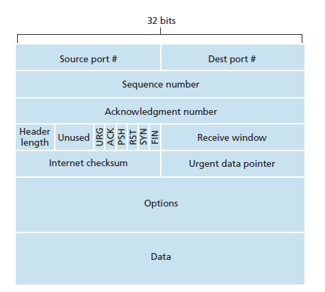
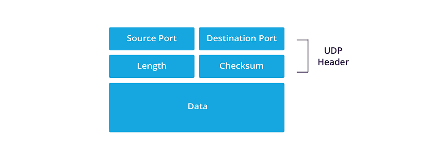

# Transportní vrstva (L4) a protokoly TCP a UDP

## Účel a princip fungování transportní vrstvy
*   **Propojení sítě s aplikacemi:** IP adresa (L3) určuje cílové zařízení, ale transportní vrstva (L4) doručuje data konkrétní aplikaci na tomto zařízení.
*   **Multiplexing:** Umožňuje vést více konverzací současně (např. stahování souboru, prohlížení webu a videohovor naráz).
*   **Segmentace/Datagramy:** Rozděluje velká aplikační data na menší části a v cíli je znovu sestavuje.
*   **Identifikace pomocí portů:** Jednotlivé konverzace a služby se odlišují logickými čísly portů.

## Porty a Sockety
*   **Port:** Logické číslo v rozsahu 0 až 65535.
    *   *Well-known ports (0-1023):* Zavedené služby (server na nich naslouchá).
    *   *Registred (1024-49151):* Registrované aplikace.
    *   *Dynamic / Private ports (49152-65535):* Přidělovány dočasně operačním systémem klientům při zahájení komunikace.
*   **Významné porty:**
    *   **TCP:** 22 (SSH), 25 (SMTP), 80 (HTTP), 443 (HTTPS), 3389 (RDP)
    *   **UDP:** 67/68 (DHCP), 123 (NTP), 161/162 (SNMP), 514 (Syslog)
    *   **TCP/UDP:** 53 (DNS)
*   **Socket:** Kombinace IP adresy a čísla portu (např. `192.168.1.10:52344`). Jedinečně identifikuje proces v síti.
*   **Identifikace spojení:** Každé spojení je definováno "pěticí": Zdrojová IP, Zdrojový port, Cílová IP, Cílový port, Protokol.
*   *Diagnostika:* Příkaz `netstat -ano` (ve Windows) zobrazí aktivní TCP spojení, naslouchající porty a ID procesů (PID).

## Segmentace a MTU (Velikost dat)
*   **MTU (Maximum Transmission Unit):** Maximální velikost dat, která projde linkovou vrstvou (u Ethernetu typicky 1500 B).
*   **MSS (Maximum Segment Size):** Maximální množství aplikačních dat v jednom TCP segmentu.
    *   *Výpočet u IPv4:* 1500 B (MTU) - 20 B (IPv4 hlavička) - 20 B (TCP hlavička) = **1460 B (MSS)**.
*   *Fragmentace:* Pokud posíláme větší UDP datagram, než je MTU, síťová vrstva (IP) jej musí rozbít na fragmenty. U IPv6 fragmentuje pouze odesílatel, ztráta 1 fragmentu znehodnotí celý datagram. TCP se fragmentaci vyhýbá tím, že automaticky dělí proud dat přesně podle MSS.

---

## TCP (Transmission Control Protocol)
### Základní vlastnosti
*   **Spojovaný (Connection-oriented):** Před přenosem dat navazuje formální spojení.
*   **Spolehlivý (Reliable):** Potvrzuje přijetí dat, automaticky opakuje přenos při ztrátě, řeší správné pořadí.
*   **Hlavička:** Minimálně 20 B (výrazně složitější než u UDP).
*   **Způsob přenosu:** Souvislý proud bajtů (hranice aplikací nejsou důležité, čte se jako tok dat).

### Řídící příznaky (Flags)
1 bit v hlavičce, určuje význam segmentu:
*   **SYN (Synchronize):** Zahájení spojení, synchronizace počátečních sekvenčních čísel.
*   **ACK (Acknowledgment):** Potvrzení. Pole potvrzovacího čísla je platné.
*   **FIN (Finish):** Korektní ukončení spojení (odesílatel už nemá další data).
*   **RST (Reset):** Okamžité odmítnutí nebo zrušení spojení (např. pokud na cílovém portu neběží služba).
*   **PSH (Push):** Okamžité předání dat aplikaci bez čekání v bufferu.
*   **URG (Urgent):** Data mají prioritu (dnes se příliš nepoužívá).

### Mechanismus komunikace TCP
1.  **Navázání spojení (3-Way Handshake):**
    *   Server je předem ve stavu **LISTEN** (např. web server naslouchá na portu 443).
    *   **Krok 1 (Klient -> Server):** Klient pošle `SYN` (Vygeneruje si náhodné sekvenční číslo `SEQ=x`).
    *   **Krok 2 (Server -> Klient):** Server odpoví `SYN-ACK` (Pošle vlastní `SEQ=y` a potvrzuje klientovo `ACK=x+1`).
    *   **Krok 3 (Klient -> Server):** Klient potvrdí `ACK` (`SEQ=x+1`, `ACK=y+1`).
    *   Obě strany přejdou do stavu **ESTABLISHED** a mohou si vyměňovat data. Teprve nyní začíná např. TLS handshake a HTTP požadavek.
2.  **Spolehlivost a sekvenční čísla:**
    *   **SEQ (Sekvenční číslo):** Označuje číslo *prvního bajtu* v odesílaném segmentu (např. posílám-li bajty 1000-1499, SEQ je 1000).
    *   **ACK (Potvrzovací číslo):** Označuje číslo *dalšího očekávaného bajtu* (příjemce pošle `ACK=1500`, čímž říká: "přijal jsem vše do 1499, pošli mi 1500").
    *   *Opakovaný přenos:* Pokud se segment ztratí cestou a příjemce nepošle včas ACK, vyprší odesílateli časovač (RTO) a data se pošlou znovu.
3.  **Řízení toku (Flow Control - Posuvné okno):**
    *   Odesílatel nesmí zahltit příjemce. Přijatá data se ukládají v TCP bufferu u příjemce, než si je přečte aplikace.
    *   Příjemce v hlavičce posílá **Receive Window (RWND)** – aktuální volné místo ve svém bufferu (v bajtech).
    *   Např. zpráva `ACK=1000, RWND=3000` znamená: "Pošli od bajtu 1000, a můžeš poslat rovnou 3000 bajtů bez čekání na další potvrzení". Pokud se buffer zaplní (RWND=0), odesílatel musí zastavit přenos.
4.  **Ukončení spojení:**
    *   Postupné odpojení pomocí `FIN` zpráv, které druhá strana potvrdí `ACK`.

### TCP segment

- **Source port (Zdrojový port):** Identifikuje port odesílající aplikace
- **Dest port (Cílový port):** Identifikuje port aplikace, které jsou data určena na straně příjemce
- **Sequence number (Sekvenční číslo):** 32bitové pole určující pořadí prvního bajtu dat v tomto segmentu pro správné znovusestavení proudu dat u příjemce
- **Acknowledgment number (Potvrzovací číslo):** Udává číslo dalšího bajtu, který příjemce logicky očekává, a tím potvrzuje doručení všech předchozích dat
- **Header length (Délka hlavičky):** Určuje celkovou velikost TCP hlavičky, aby příjemce poznal, kde končí řídicí informace a začínají samotná data
- **Unused (Nevyužito):** Bity rezervované pro budoucí úpravy protokolu, standardně jsou nastavené na nuly
- **URG, ACK, PSH, RST, SYN, FIN (Řídicí příznaky/Vlajky):** Šest bitů, které určují aktuální stav a chování spojení (např. SYN pro navázání spojení, FIN pro korektní ukončení, ACK pro potvrzení, RST pro okamžité zahození)
- **Receive window (Velikost přijímacího okna / RWND):** Slouží k řízení toku dat; informuje odesílatele o tom, kolik volného místa (v bajtech) aktuálně zbývá v přijímacím bufferu, aby nedošlo k jeho zahlcení
- **Internet checksum (Kontrolní součet):** Slouží k ověření integrity hlavičky i samotných dat a detekuje chyby, které mohly vzniknout během přenosu na lince
- **Urgent data pointer (Urgentní ukazatel):** Používá se výhradně s příznakem URG a ukazuje, kde v datovém toku přesně končí prioritní (urgentní) data
- **Options (Volby):** Nepovinné pole určené pro dodatečné parametry spojení (zde si například obě strany během třícestného handshake domlouvají velikost MSS)
- **Data (Data):** Samotný užitečný náklad (payload) od aplikační vrstvy, který je segmentem přenášen
---

## UDP (User Datagram Protocol)
### Základní vlastnosti
*   **Nespojovaný (Stateless):** Rovnou posílá data. Neověřuje dostupnost sítě, zařízení ani to, jestli cílová aplikace běží.
*   **Nespolehlivý (Best-effort):** Nepotvrzuje doručení, neopakuje ztracená data.
*   **Zachování datagramů:** Jedno odeslání aplikací = jeden samostatný paket. Přijímající aplikace to přečte jako jeden celek.
*   **Hlavička:** Pouze 8 B. (Zdrojový port, Cílový port, Délka UDP, Kontrolní součet).

### Mechanismus a omezení
*   **Chybí mechanizmy z TCP:** Žádný handshake, žádné zotavení ze ztrát, žádné řazení datagramů (mohou dorazit v jiném pořadí, nebo jako duplikáty), žádné řízení toku a přetížení sítě.
*   **Kontrolní součet (Checksum):** Umožňuje detekovat poškození během přenosu. Pokud je paket poškozen, UDP jej *okamžitě zahodí*. Nijak nespouští opětovné odeslání.

### Využití UDP v praxi (Scénáře)
*   **DNS:** Rychlé krátké dotazy (jeden dotaz = jedna odpověď). Navazovat TCP handshake kvůli pár bajtům by zbytečně protáhlo latenci.
*   **DHCP:** UDP se dá posílat jako broadcast (z IP adresy 0.0.0.0), což je nezbytné, když klient ještě žádnou IP adresu nemá (TCP tohle neumožňuje, vyžaduje jasnou point-to-point komunikaci).
*   **VoIP a Živé video (živé streamy):** Rychlost je přednější než 100% přesnost. Když u VoIP vypadne paketik, zvuk trochu zadrhne (nebo se chyba dopočítá), ale kdyby se využilo TCP, hovor by zamrznul při čekání na opětovné zaslání dat, a ta zpožděná data by už byla zbytečná.
*   **Online Hry:** Pozice hráče a neustálé aktualizace se řeší přes UDP. "Nevracej mě zpátky pro ztracený paket polohy, zajímá mě poloha teď". Naopak např. přihlášení do hry nebo potvrzení zásahu mohou řešit spolehlivějšími mechanismy.

### UDP datagram

- **Source port (Zdrojový port):** Identifikuje port odesílající aplikace
- **Dest port (Cílový port):** Identifikuje port aplikace, které jsou data určena na straně příjemce
- **Length (Délka):** Udává celkovou délku UDP hlavičky a přenášených dat v bajtech
- **Checksum (Kontrolní součet):** Slouží k ověření integrity hlavičky i samotných dat a detekuje chyby, které mohly vzniknout během přenosu
---

## Evoluce: QUIC a HTTP/3 (Moderní využití UDP)
*   TCP trpí problémem zvaným *Head-of-line blocking* (když se ztratí jeden segment, celá fronta dat stojí a čeká na jeho přenos, i když další data už v pořádku dorazila).
*   **QUIC (vyvinuto Googlem, používá ho HTTP/3):** Běží **nad UDP**.
*   Bere si rychlost a nespojovost UDP, ale vlastními mechanismy (implementovanými nad UDP) přidává spolehlivost, šifrování (TLS 1.3 v základu) a **multiplexování nezávislých proudů**.
*   Pokud se na webu přes QUIC ztratí balík z obrázku, HTML a CSS se dál plynule stahují, protože jedou ve svých nezávislých proudech
*   QUIC pozná spojení pomocí logického **Connection ID**, nikoliv podle IP (takže TCP se při změně z Wi-Fi na 5G přeruší, QUIC plynule pokračuje stahovat)