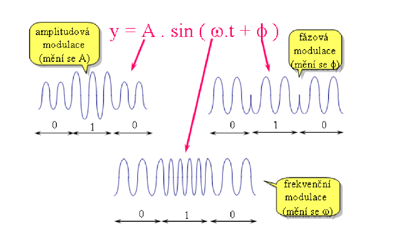
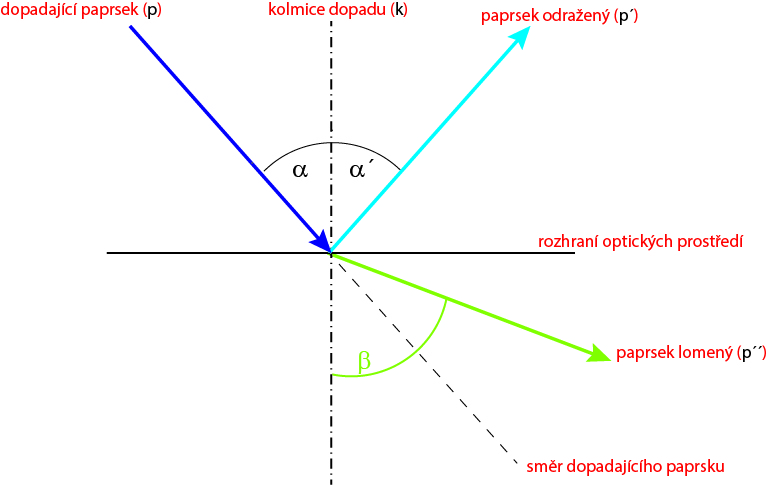

# Kontrolní otázky – Počítačové sítě (1. ročník – 1. pololetí)

## 1. Rozdíl mezi přepínáním okruhů a paketů
- **Přepínání okruhů** – vytvoří se trvalé spojení (např. telefonní hovor).
- **Přepínání paketů** – data se rozdělí na pakety, které putují různými cestami (např. internet).

## 2. Analogová vs. digitální síť
- **Analogová** – přenáší spojitý signál (např. starý telefon).
- **Digitální** – přenáší data jako 0 a 1. Rychlejší, spolehlivější.

## 3. Klient-server vs. peer-to-peer
- **Klient-server** – klienti komunikují se serverem (např. webová stránka).
- **P2P** – počítače si data vyměňují přímo (např. torrenty).

## 4. Sběrnicová topologie
- Všechna zařízení jsou připojena na jeden kabel.
- **+** Jednoduchá a levná  
- **–** Porucha jednoho místa vyřadí celou síť

## 5. Hvězdicová topologie
- Všechna zařízení připojena ke switchi.
- **+** Porucha jednoho kabelu neovlivní ostatní  
- **–** Porucha switche = výpadek celé sítě

## 6. Rozdíl mezi hvězdou a stromem
- **Hvězda** – každé zařízení vede přímo do centra.
- **Strom** – hierarchická síť složená z více hvězd (např. switch + podsítě).

## 7. LAN, MAN, WAN
- **LAN** – místní síť (škola, dům)  
- **MAN** – městská síť  
- **WAN** – globální síť (internet)

## 8. Veřejná, privátní a VPN síť
- **Veřejná** – otevřená, např. kavárna  
- **Privátní** – uzavřená, např. domácí Wi-Fi  
- **VPN** – bezpečné propojení přes internet

## 9. OSI model
- 7 vrstev od fyziky po aplikaci:  
  1. Fyzická  
  2. Linková  
  3. Síťová  
  4. Transportní  
  5. Relační  
  6. Prezentační  
  7. Aplikační  

## 10. TCP/IP model
- 4 vrstvy:  
  1. Přístup k síti  
  2. Internetová  
  3. Transportní  
  4. Aplikační

## 11. Strukturovaná kabeláž (SKS)
- Organizace kabelů v budově: zásuvky, patch panely, racky.
- Snadná údržba a rozšiřitelnost.

## 12. Synchronní, asynchronní, arytmický přenos
- **Synchronní** – přesný čas  
- **Asynchronní** – start/stop bity  
- **Arytmický** – nepravidelné  
- **Manchester kódování** – zabudovaná synchronizace

## 13. Kolik vodičů je potřeba pro přenos?
- **Minimálně 2** – signál + zem. Např. Ethernet (4 vodiče = 2 páry).

## 14. Baseband vs. broadband + modulace
- **Baseband** – přímý přenos  
- **Broadband** – využívá modulaci  
- **Modulace:**  
  - AM – amplituda (nejméně odolná)  
  - FM – frekvence  
  - PM – fáze

## 15. UTP, STP, FTP, S-STP
- **UTP** – nechráněný  
- **STP** – stínění každé dvojice  
- **FTP** – stínění celkově  
- **S-STP** – dvojité stínění

## 16. Kategorie kabelů
- **Cat5e** – 100 MHz, 1 Gbit/s  
- **Cat6** – 250 MHz  
- **Cat6a** – 500 MHz  
- **Cat7/7a/8** – až 40 Gbit/s

## 17. RJ-45, pořadí vodičů, křížený kabel
- **RJ-45** – konektor Ethernet  
- **Standard T568B:**  
  1. Bílá/oranžová  
  2. Oranžová  
  3. Bílá/zelená  
  4. Modrá  
  5. Bílá/modrá  
  6. Zelená  
  7. Bílá/hnědá  
  8. Hnědá  
- **Křížený kabel** – pro propojení 2 PC bez switche  
- **Krimpovací kleště** – pro montáž

## 18. Impedance + schéma
- **Impedance** – odpor střídavému proudu  
- **Schéma** – R + C + L (rezistor, kondenzátor, cívka)

## 19. Maximální délka TP kabelu
- **100 m celkem:**  
  - 90 m ve zdi  
  - 10 m patch kabely  
- **Patch kabel** – ohebný spojovací

## 20. Odraz a lom světla (Snellius)
- **Odraz:** úhel dopadu = úhel odrazu  
- **Lom:** změna směru při přechodu mezi médii  
- **Kritický úhel:** úplný vnitřní odraz

## 21. Struktura optického vlákna
- **Jádro (n1)** + **plášť (n2)**, kde n1 > n2  
- Typy: skleněné, plastové  
- Využití: internet, medicína

## 22. Druhy vláken podle módu
- **Singlemode** – 8–10 µm jádro, pro dlouhé vzdálenosti  
- **Multimode** – 50/62.5 µm jádro, pro kratší vzdálenosti

## 23. Ztráty a spojování vláken
- **Ztráty:** útlum, ohyb, konektory  
- **Spoje:** sváření, konektory, lepení  
- **Výhody optiky:** rychlost, bezpečnost, vzdálenost

## 24. Co je media konvertor, SFP, GBIC, miniGBIC
- **Media konvertor** – převádí metaliku <-> optiku  
- **SFP** – malý modul pro optiku  
- **GBIC** – starší, větší  
- **miniGBIC = SFP**
****

# Kontrolní otázky – Počítačové sítě (1. ročník – 2. pololetí)

## 1. Model TCP/IP vs OSI:

**TCP/IP**

| Vrstva |               Název vrstvy                |                     Funkce                     |               PDU               |
|:------:|:-----------------------------------------:|:----------------------------------------------:|:-------------------------------:|
|   4    |      Aplikační vrstva (Application)       | Poskytuje síťové služby aplikacím (HTTP, FTP). |            **Data**             |
|   3    |      Transportní vrstva (Transport)       |       Spolehlivý přenos dat (TCP, UDP).        |           **Segment**           |
|   2    |         Síťova vrstva (Internet)          |          Směrování paketů (IP, ICMP).          |      **Datagram (Paket)**       |
|   1    | Vrstva síťového přístupu (Network Access) |   Přístup k fyzické síti (Ethernet, Wi-Fi).    | **Rámec (Frame) / Bity (Bits)** |


**ISO/OSI**

| Vrstva | Název vrstvy                   | Funkce                                               |
|:------:|:-------------------------------:|:----------------------------------------------------:|
|   7    | Aplikační vrstva (Application)   | Poskytuje služby aplikacím (e-mail, přenos souborů). |
|   6    | Prezentační vrstva (Presentation)| Převádí a šifruje data.                             |
|   5    | Relační vrstva (Session)         | Navazuje, spravuje a ukončuje spojení.              |
|   4    | Transportní vrstva (Transport)   | Spolehlivý přenos mezi zařízeními.                  |
|   3    | Síťová vrstva (Network)          | Směrování a adresování paketů.                      |
|   2    | Linková vrstva (Data Link)        | Přenos dat na úrovni rámců mezi zařízeními.         |
|   1    | Fyzická vrstva (Physical)         | Přenos bitů přes fyzické médium.                    |


- Model TCP/IP má 4 vrstvy – Vrstva síťového přístupu `Network Access` (fyzická+datalink), síťová `Network`, transportní `Transport` a aplikační `Application`

- OSI model jich má 7 (fyzická, spojová, síťová, transportní, relační, prezentační, aplikační). Funkce session/presentation/aplikace OSI jsou v TCP/IP seskupeny do jedné aplikační vrstvy​

- Naopak fyzická a linková vrstva OSI odpovídají síťového přístupu TCP/IP.

## 2. Strukturovaná kabeláž

Je organizovaný systém kabelů v budově (např. kanceláři, škole nebo domě) tak, aby vše, co je třeba připojit k síti.

obrazek k tomu:

```
(serverová skříň)
    │
    │
(patch panel)
    │
    ├── zásuvka 1 → počítač 1
    ├── zásuvka 2 → počítač 2
    ├── zásuvka 3 → tiskárna
    └── zásuvka 4 → Wi-Fi router
```
> Patch panel, propojovací pole, je zpravidla zrdcadlo k datovým zásuvkám, od kterých vedou síťové (ethernet) kabely


## 3. Synchronní vs asynchronní vs arytmický přenos; Manchester

1. **Synchronní** přenos používá společný hodinový signál – vysílač i přijímač přesně vědí, kdy začíná každý bit
2. **Asynchronní** přenos nemá společný hodinový signál; data jsou obvykle odděleny start/stop bity
3. **Arytmický** přenos (často se nerozlišuje od asynchronního) znamená nepravidelný přenos bez stabilního rytmu
4. **Manchesterovo kódování** je bitová modulace, kde každý bit je vyjádřen přechodem signálu (např. 1 = střídavá změna 1→0, 0 = 0→1); umožňuje synchronizaci hodin bez samostatného hodinového vodiče (Ethernetu 10Base-T)

## 4. Minimální počet vodičů u metalického vedení
 
Pro základní přenos je nutné mít dva vodiče: signálový a zemní (referenční)

> navic
> ale pro Ethernet 10/100 mb/s je potřeba mit 4 vodiče (2 pary) bílo-oranžová & oranžová a bílo-zelená & zelená - T568B
> Oranžový pár je připojen na piny 1 a 2 → slouží k vysílání ( Tx = Transmission (vysílání) )
> Zelená dvojice je připojena ke kolíkům 3 a 6 → slouží k příjmu ( Rx = Reception (příjem) )

## 5. Základní (baseband) vs modulované (přeložené) pásmo

**Baseband** znamená - data se posílají po kabelu přímo, bez žádného rozdělení na víc kanálů.
- Celý kabel je jen pro jeden signál najednou.

**Broadband** - tam jeden kabel nese víc signálů najednou, každý na jiné frekvenci (využívá sinusovou vlnu)
- Druhy modulace:
  - AM (amplitudová) – nejméně odolná.
  - FM (frekvenční) – odolnější vůči rušení.
  - PM (fázová) – využívá změnu fáze signálu.



Fázová modulace (PSK) je odolnější, protože šum má malý vliv na změnu fáze signálu. Změnit fázi je mnohem těžší než změnit amplitudu, takže data zůstávají stabilnější i v rušném prostředí.


## 6. Kroucená dvoulinka

**TP znamena TWISTED PAIR**

Typy:
-  UTP – nestíněná.
-  STP – stíněná.
-  S-STP – dvojitě stíněná.
-  FTP – fóliově stíněná.

## 7. Kategorie TP kabelů

- Cat 5e – 1 Gbit/s.
- Cat 6 – 1 Gbit/s, lepší odstínění.
- Cat 6a – 10 Gbit/s.
- Cat 7 – 10 Gbit/s, lepší stínění.
- Cat 8 – až 40 Gbit/s.

## 8. RJ-45 konektor

- Standardní konektor pro síťové kabely
- T568B je
  - 1 –- bílo-oranžový
  - 2 –- oranžový
  - 3 –- bílo-zelený
  - 4 –- modrý
  - 5 –- bílomodrý
  - 6 –- zelený
  - 7 –- bílo-hnědý
  - 8 –- hnědý
- Přepínaný (crossover) kabel se používá pro přímé propojení dvou stejných zařízení bez automaticky MDIX – např. PC–PC, switch–switch či hub–hub v starších sítích
- Krimpovací kleště jsou nástroj na zasunutí (zakrimpování) vodičů do konektoru RJ45 (stlačení kovových kontaktních nožiček)

## 9. Délka TP kabelu

Max. délka kabelu v běžné LAN (TP) je 100 m podle norem (např. 90 m pevného rozvodu + 10 m celkem zástrček/patch kabelů)

## 10. Zákon odrazu a zákon lomu (Snellův zákon)

1. Zákon odrazu:
- Světlo, které dopadne na hladký povrch, se odrazí tak, že úhel dopadu je stejný jako úhel odrazu. Úhly se měří od kolmice k povrchu.
2. Zákon lomu (Snellův zákon):
- Když světlo přechází z jednoho prostředí do druhého (například ze vzduchu do vody), změní svůj směr – „lomí se“. To, jak moc se světlo ohne, závisí na hustotě obou prostředí.
3. Kritický úhel:
- Je to takový úhel dopadu, při kterém se světlo už neláme do druhého prostředí, ale klouže po rozhraní.
4. Totální odraz:
- Když je úhel dopadu větší než kritický, světlo se vůbec neláme ven, ale celé se odrazí zpátky. Tento jev se využívá například v optických vláknech.




## 11. Optické vlákno – stavba a materiál

1. Vlákno se skládá z **jádra (core)**, **ochrannýho povlaka (coating)** a **pláště (cladding)**
2. Materiálově jsou nejběžnější skleněná vlákna a plastová vlákna 
3. Příklady použití: přenos vysokorychlostních dat na dlouhé vzdálenosti (telekomunikace, mezi městy), páteřní sítě (LAN/MAN), připojení serverů, kabelová televize

## 12. Optické vlákno podle vidů (počtu módů)

1. Základní rozdělení je na **jednovidová (single-mode)** a **mnohovidová (multi-mode)** vlákna
  - **Jednovidové** vlákno má velmi malý průměr jádra (~8–10 µm, plášť ~125 µm), podporuje jen jeden mód (paprsek)
  - Používá se pro dálkový přenos (1310/1550 nm)
  - **Mnohovidové** vlákno má větší jádro (typicky 50 µm nebo 62,5 µm, plášť 125 µm) a přenáší více módů zároveň. 

## 13. Ztráty a spoje v optickém vláknu

1. Ztráty ve vlákně vznikají hlavně:
- absorpčním útlumem materiálu
- rozptylem (malé nerovnosti)
- a ztrátami při ohybech (ohybné ztráty)
2. pojování vláken se provádí svařováním (fusion splice – nejmenší útlum, trvalý spoj) nebo mechanickým spojem (mechanical splice, koncovky) či konektory (VCSEL, SC, LC atd.)
3. Výhody optického přenosu vs kovový: 
- Mnohem vyšší šířka pásma (Gb/s až Tb/s)
- Menší útlumy na velké vzdálenosti 
- Odolnost vůči elektromagnetickému rušení 
- Tenké a lehké kabely 

## 14. Mediakonvertor, SFP, GBIC

1. **Mediakonvertor** je zařízení pro propojení různých typů médií – typicky konvertuje ethernet z metalického (TP) na optické vlákno a naopak
2. **GBIC (Gigabit Interface Converter)** byl dřívější modulární transceiver pro 1Gbit linky
3. **miniGBIC/SFP (Small Form-factor Pluggable)** jsou novější, menší a výkonnější modulární transceivery pro různé rychlosti (1G, 10G) a média (optika, metal)

## 15. Síťové protokoly a model TCP/IP

Protokol je soubor pravidel pro komunikaci

- **Aplikační vrstva:** HTTP, FTP, SMTP, DNS, DHCP apod. (aplikace pro síťové služby) - `Aplikační protokoly`
- **Transportní vrstva:** TCP (reliabilní přenos, kontrola chyb) a UDP (datagramový, bez záruk) - `Transportní protokoly`
- **Síťová vrstva:** IP (IPv4/IPv6 – směrování paketů), ICMP (diagnostika), případně ARP (řeší mapování IP→MAC na linkové vrstvě) - `Síťové protokoly`
- **Síťové rozhraní:** Ethernet, PPP, 802.11 (Wi-Fi), VLAN, a další protokoly pro přístup k fyzickému médiu - `Protokoly síťového rozhraní`

## 16. Ethernet – obecně

1. Ethernet je přenosovou technologií zajišťující skutečný přenos dat, protokol, standart
2. TCP\IP & ISO/OSI:
  - Vrsty ISO/OSI: L2 (linková), L1 (fyzická).
  - Vrsty TCP/IP: Síťové rozhraní (L1)
3. Topologie - hvězdicová

## 17. MAC adresa

1. Fyzická adresa síťového zařízení obvykle zapsaná jako 6 hexadecimálních oktetů (např. `00:1A:2B:3C:4D:5E`), Prvních 24 bitů je OUI (organizationally unique identifier) výrobce zařízení, zbývajících 24 bitů je unikátní identifikátor samotného zařízení. MAC se používá na datalinkové vrstvě pro adresování rámců.

- Broadcast MAC: `FF:FF:FF` prvni 3 bity
- Multicast MAC: `01:00:5E` prvni 3 bity
- Unicast MAC: `00:1A:2B` prvni 3 bity

## 18. Dvojková a šestnáctková soustava

`204`
- Převod 11001100 (binárně) → CC (hexadecimálně).

## 19. CSMA/CD

- Carrier Sense Multiple Access with Collision Detection – protokol přístupu v původním Ethernetu. Stanice „naslouchají“, zda je médium volné (carrier sense); při vysílání zároveň detekují kolizi (simultánní vysílání více stanic). Při kolizi vyšlou „jam“ signál (aby kolizi potvrdily ostatním) a po náhodné prodlevě se pokusí znovu (backoff algoritmus). CSMA/CD se již nepoužívá ve switchovaných full-duplex sítích (kde kolize nejsou možné)

## 20. Broadcast/Unicast/Multicast (linková vrstva):

1. Broadcast je odeslání na všechny stanice v dané síti - `FF:FF:FF`
2. Muulticast je skupinová adresa – rámec je určen výhradně uzlům, které jsou členy dané skupiny - `01:00:5E:` (IPv4), `33:33:` (IPv6)
3. Unicast je směrováno na jednu konkrétní MAC adresu (jedno zařízení) `00:1A:2B`

## 21. Formát Ethernetového rámce

| Část rámce               | Velikost (bajty) | Popis                                  |
|:-------------------------|:----------------:|:--------------------------------------:|
| Preambule                | 7                | Synchronizace signálu (fyzická vrstva) |
| SFD (Start Frame Delimiter) | 1              | Označení začátku rámce                |
| Cílová MAC adresa         | 6                | Adresa příjemce                       |
| Zdrojová MAC adresa       | 6                | Adresa odesílatele                    |
| Typ / Velikost            | 2                | Určuje typ protokolu nebo délku dat   |
| Data / Payload            | 46–1500          | Přenášená data                        |
| FCS (Frame Check Sequence)| 4                | Kontrolní součet (CRC)                |


## 22. Zapouzdření (encapsulace) a rozbalení (deencapsulace)

1. **Zapouzdření (encapsulace)** - Při odesílání dat aplikační vrstva předá údaje transportní vrstvě, která přidá vlastní hlavičku (segmentu), pak síťová vrstva přidá hlavičku (DATAGRAM nebo IP paket) a datalinková přidá další hlavičku (Ethernetový rámec)
postupné přidávání vrstev
2. Při příjmu se rámec otevře (odstraní FCS a hlavičku linkové vrstvy), pak se předá vyšší vrstvě, která zase odstraní vlastní hlavičku, až na úrovni aplikace zůstane původní data – to je **deencapsulace**

## 23. Rámec vs. paket

1. Rámec je datový blok datalinkové vrstvy, obsahuje celou hlavičku Ethernetu a data (např. IP paket).
2. Rámec (frame) je větší než paket.
   - Paket je data na síťové vrstvě (např. IP).
   - Rámec (Frame) je data na linkové vrstvě (např. Ethernet).
     - Rámec = Paket + přídavné informace (hlavička a konec rámce), které jsou potřeba pro přenos v síti. Proto je rámec větší než paket.

## 24. Hub vs switch:
1. Hub (česky „rozbočovač“) šechny pakety přijaté na kterýkoli port zopakuje na všechny ostatní porty. Všichni tak sdílejí jeden vysílací kanál (jedna kolizní doména), a na hubu tedy platí CSMA/CD (srážky). Huby mají velmi malé zpoždění (přibližně latence opakování signálu), protože nevyhodnocují adresy – jen zesílí a rozesílají signál.
2. Switch (česky „přepínač“) je zařízení 2. vrstvy. Ze záběru Ethernetových rámců získává (učí se) zdrojové MAC adresy a ukládá je do CAM tabulky (port→MAC). Při příjmu rámce přepne (přesměruje) jej pouze na port, na kterém se nachází cílová MAC (nebo multimastík třeba na několik portů). Pokud cíl nezná, provede flood (záplavový přenos do všech portů). Switch vytváří oddělené kolizní domény pro každý port – zařízení jsou tedy oddělena, kolize prakticky nevznikají (ve full duplexu).

## 25. Full duplex vs half duplex:

1. Full duplex – současný přenos oběma směry.
2. Half duplex – přenos střídavě.
3. Full duplex se používá od 100 Mbit/s.

## 26. Rychlosti „drátového Ethernetu“ (IEEE 802.3x)

- 10 Mbit/s: 10BASE-T (10 Mb/s, kabel cat3/4/5), někdy také starší 10BASE2 (thin coax) nebo 10BASE5 (thick coax).
- 100 Mbit/s: 100BASE-TX (Fast Ethernet, 100 Mb/s, kabel min. Cat5) – běžná metalická varianta; 100BASE-FX (optika, MM vláknem).
- 1 Gbit/s: 1000BASE-T (Gigabit, 1 Gb/s, kabel min. Cat5e/6); 1000BASE-SX/LX (optické multimode/singlemode).
- 10 Gbit/s: 10GBASE-T (10 Gb/s, kabel Cat6A/7, 30–100 m); 10GBASE-SR/LR (optika: SR – short-range multimode, LR – long-range singlemode).
- 40 Gbit/s: 40GBASE-SR4 (10 Gb/s na 4 vlákna, multirežim OM3/OM4).
- 100 Gbit/s a vyšší: 100GBASE-SR10 (10 Gb/s na 10 vláken MM), 100GBASE-LR4 (4×25Gb na SMF), 100GBASE-CR (4×25Gb twinax krátký); dále 200G/400G (např. 400GBASE-SR8 či CR8 po osmi párech).

## 27. Vznik CAM tabulky na switchi

- Switch se „učí“ sledováním zdrojových MAC adres přijímaných rámců. Když přijde rámec na portu X se zdrojovou adresou A, switch v CAM (MAC) tabulce uloží záznam „MAC A → port X“. Takto postupně buduje mapování, které port odkud zná. Tabulka se časem aktualizuje (starší záznamy mohou vypršet). Tím switch ví, na který port má poslat rámec směřovaný na danou MAC. (Bez externí citace, princip.)

## 28. Proces přepínání rámců ve switchi

Po přijetí rámce switch ověří cílovou MAC adresu:

- Pokud je cíl v CAM tabulce a je záznam pro jiný port než vstupní, rámec přepošle pouze na ten cílový port.

P- okud je cíl ve stejné (vstupní) portu, rámec zahodí (nikdo jiný jej nepotřebuje).

- Pokud cíl není znám (není v tabulce), rámec flooduje – odešle ho na všechny ostatní porty (broadcast na známost).
- Mezitím switch zaznamená zdrojovou MAC (jak bylo řečeno v bodě 27) a aktualizuje si tabulku. Při opakovaném přenosu již switch zná, kterým portem doručit rámec cíli. (Zjednodušeně: switch zapíše zdrojovou adresu do tabulky a přepne data jen na port určený cílovou adresou; neznámé adresy rozesílá všude.)