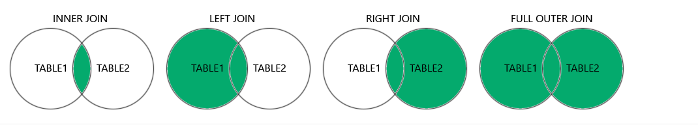

# Joins
Funkce JOIN se používá pro sloučení řádků ze dvou nebo více tabulek na základě sloupce, který je mezi nimi společný (propojený)

Máte dvě tabulky: "Zákazníci" a "Objednávky". JOIN pomáhá sestavit v jedné sestavě například jméno zákazníka z první tabulky a celkovou částku objednávky z druhé.

## Hlavní typy JOINů

Existují čtyři hlavní typy JOINů. Všechny se liší tím, jakým způsobem zpracovávají řádky, pro které neexistuje shoda v obou tabulkách.

| Typ JOINu           | Popis                | Co zahrnuje do výsledku |
|---------------------|----------------------|---------------------------|
| `INNER JOIN`          | Nejběžnější typ.     | Pouze shodné (protínající se) řádky z obou tabulek. Pokud zákazník nemá objednávky, nebo objednávka nemá zákazníka, jsou tyto řádky vyloučeny. |
| `LEFT (OUTER) JOIN`   | "Levé" sloučení.     | Všechny řádky z levé tabulky a shodné řádky z pravé. Pokud shoda v pravé tabulce neexistuje, pro tyto sloupce se uvede `NULL`. |
| `RIGHT (OUTER) JOIN`  | "Pravé" sloučení.    | Všechny řádky z pravé tabulky a shodné řádky z levé. Pokud shoda v levé tabulce neexistuje, pro tyto sloupce se uvede `NULL`. |
| `FULL (OUTER) JOIN`   | Úplné sloučení.       | Všechny řádky z obou tabulek. Pokud shoda existuje, řádky se sloučí; pokud ne, do chybějících sloupců se vloží `NULL`. |

### 1. `INNER JOIN` (Vnitřní sloučení)
- **Pouze průnik (společná část)**
### 2. `LEFT JOIN` (Levé sloučení)
- **Celá levá tabulka + průnik**
### 3. `RIGHT JOIN` (Pravé sloučení)
- **Celá pravá tabulka + průnik**
### 4. `FULL JOIN` (Úplné sloučení)
- **Celý obsah obou tabulek**



## SYNTAXE

### `INNER JOIN`

```sql
SELECT ProductID, ProductName, CategoryName
FROM Products
INNER JOIN Categories ON Products.CategoryID = Categories.CategoryID;
```

### `LEFT JOIN`
```sql
SELECT column_name(s)
FROM table1
LEFT JOIN table2
ON table1.column_name = table2.column_name;
```

### RIGHT JOIN

```sql
SELECT column_name(s)
FROM table1
RIGHT JOIN table2
ON table1.column_name = table2.column_name;
```

### `FULL JOIN`
```sql
SELECT column_name(s)
FROM table1
FULL OUTER JOIN table2
ON table1.column_name = table2.column_name WHERE condition;
```